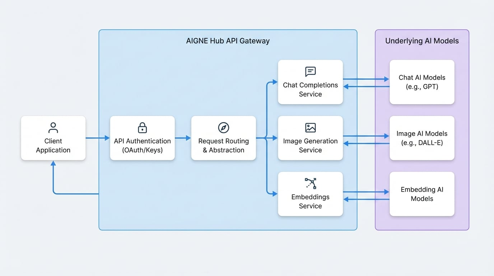

# API 参考

本文档提供了 AIGNE Hub RESTful API 的技术规范。通过本指南，您将了解如何进行身份验证并与聊天补全、图像生成和嵌入等核心端点进行交互，从而实现与您的应用程序的稳健后端集成。

AIGNE Hub API 为各种底层 AI 模型提供了统一的接口，从而抽象了各个提供商 API 的复杂性。所有请求都使用 API 密钥进行身份验证。

下图说明了应用程序、AIGNE Hub API 和底层 AI 模型之间的交互。

<!-- DIAGRAM_IMAGE_START:architecture:16:9 -->

<!-- DIAGRAM_IMAGE_END -->

有关每个端点的详细规范，包括请求和响应模式，请参阅具体的子章节：

<x-cards data-columns="3">
  <x-card data-title="聊天补全" data-icon="lucide:message-square-text" data-href="/api-reference/chat-completions">
    聊天补全端点的详细规范，包括请求/响应模式和流式传输支持。
  </x-card>
  <x-card data-title="图像生成" data-icon="lucide:image" data-href="/api-reference/image-generation">
    图像生成端点的参考，涵盖支持的模型以及尺寸和质量参数。
  </x-card>
  <x-card data-title="嵌入" data-icon="lucide:codesandbox" data-href="/api-reference/embeddings">
    用于创建文本向量表示的文档，可用于语义搜索和其他机器学习任务。
  </x-card>
</x-cards>

<x-cards>
  <x-card data-title="API 身份验证" data-icon="lucide:key-round" data-href="/api-reference/authentication">
    解释如何使用 OAuth 和 API 密钥安全地验证对 AIGNE Hub API 的请求。
  </x-card>
</x-cards>

## 端点

下表提供了可用 API 端点的摘要。

| Method | Endpoint                    | Description                                        |
| :----- | :-------------------------- | :------------------------------------------------- |
| `POST` | `/chat/completions`         | 为给定的聊天对话生成响应。|
| `POST` | `/embeddings`               | 为给定的输入文本生成向量嵌入。|
| `POST` | `/image/generations`        | 根据文本提示创建图像。           |
| `POST` | `/audio/transcriptions`     | 将音频转录为输入语言。         |
| `POST` | `/audio/speech`             | 根据输入文本生成音频。               |
| `GET`  | `/status`                   | 检查服务和模型的可用性。 |

## 总结

本节概述了 AIGNE Hub API，涵盖了身份验证和可用端点的摘要。要进行实际集成，请继续阅读每个端点的详细文档。

- **构建对话式 AI：** 请参阅[聊天补全 API](./api-reference-chat-completions.md)。
- **生成图像：** 探索[图像生成 API](./api-reference-image-generation.md)。
- **进行文本分析和搜索：** 使用[嵌入 API](./api-reference-embeddings.md)。