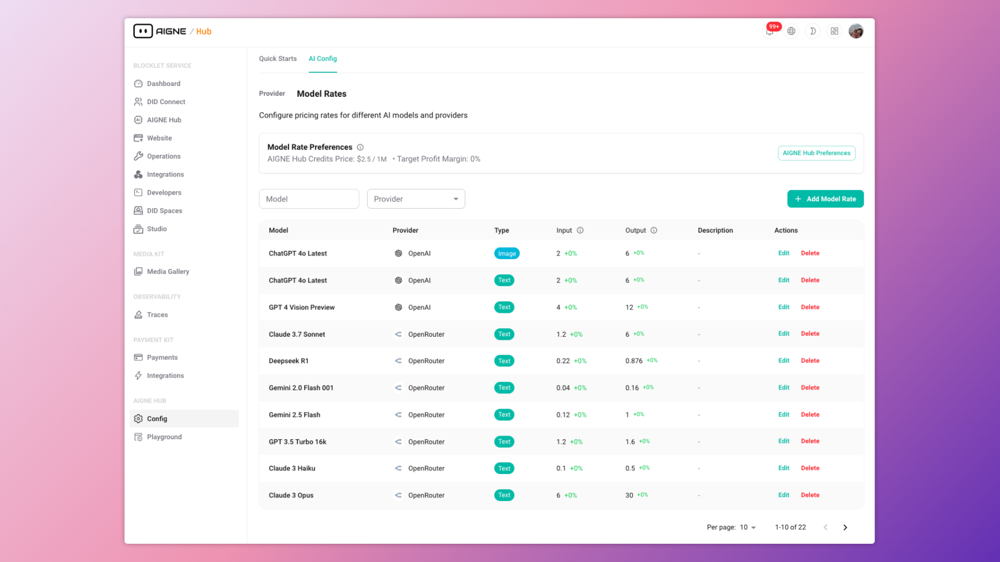

# サービスプロバイダーモード

独自のマルチテナント AI サービスを提供する準備はできていますか？このガイドでは、AIGNE Hub でサービスプロバイダーモードを有効にする方法について詳しく説明します。クレジットベースの請求システムを有効にし、Payment Kit を統合し、カスタム価格を定義して、ユーザー向けの収益化された AI ゲートウェイを作成する方法を学びます。

サービスプロバイダーモードは、AIGNE Hub を社内ツールから、顧客向けのフル機能プラットフォームへと変えます。コア機能の上に包括的な請求および収益化レイヤーを追加することで、幅広い AI モデルへのアクセスを再販できます。これは、SaaS プラットフォーム、代理店、および AI 機能をサービスとして提供したい開発者にとって理想的です。

社内利用のために AIGNE Hub をデプロイする方法については、[エンタープライズセルフホスティング](./deployment-scenarios-enterprise-self-hosting.md) のドキュメントを参照してください。

## 仕組み

サービスプロバイダーモードが有効になると、AIGNE Hub はプリペイドのクレジットベースシステムで動作します。次の図は、そのワークフローを示しています。

<!-- DIAGRAM_IMAGE_START:flowchart:16:9 -->

<!-- DIAGRAM_IMAGE_END -->

ワークフローは次のとおりです。

1.  **ユーザーオンボーディング**：新規ユーザーはシステム内に自動的に登録されます。スタータークレジットを設定して、すぐにサービスを試せるようにすることができます。
2.  **クレジット購入**：ユーザーは支払いリンクを通じてクレジットを購入します。このプロセスは、チェックアウトセッションと支払い処理を管理するコンパニオン Blocklet である **Payment Kit** によって管理されます。
3.  **AI モデルの使用**：ユーザーは AIGNE Hub に API コールを行い、さまざまな AI モデルと対話します。
4.  **クレジット控除**：各 API コールに対して、AIGNE Hub はカスタム定義されたモデルレートに基づいてコストを計算し、対応する金額をユーザーのクレジット残高から差し引きます。
5.  **使用状況の追跡**：すべてのトランザクションが記録され、管理者とユーザーの両方に消費と支出に関する詳細な分析を提供します。

このモデルは、マルチテナント AI サービスを管理するための柔軟でスケーラブルな方法を提供し、使用量が正確かつ自動的に請求されることを保証します。

## 設定手順

クレジットベースの請求システムを有効にするには、Payment Kit をインストールし、価格モデルを設定する必要があります。

### 1. Payment Kit をインストールする

Payment Kit は、AIGNE Hub と統合して、顧客管理、クレジット購入、チェックアウトプロセスなど、すべての支払い関連機能を処理する別の Blocklet です。

インストールするには：

1.  Blocklet Server の管理インターフェースで **Blocklet Store** に移動します。
2.  **"Payment Kit"** を検索します。
3.  **"Launch"** をクリックし、インストールウィザードに従ってデプロイします。

Payment Kit が実行されると、AIGNE Hub はそれを自動的に検出し、必要な請求機能を有効にします。

### 2. カスタム価格モデルを定義する

請求システムを有効にした後、ユーザーの消費が請求されるレートを定義する必要があります。これにより、独自の価格設定が可能になり、アップストリーム AI プロバイダーからのコストにマージンを含めることができます。

1.  AIGNE Hub の管理ダッシュボードで、**Config** > **Model Rates** に移動します。
2.  **"Add Model Rate"** をクリックして設定モーダルを開きます。
3.  必要なフィールドを入力して、特定のモデルの価格を定義します。
    *   **Model Name**: モデルの識別子（例：`gpt-4o`）。
    *   **Rate Type**: モデルが処理するコンテンツの種類（例：Text, Image）。
    *   **Providers**: このモデルのアップストリーム AI プロバイダー。
    *   **Model Cost**: プロバイダーに支払う実際のコスト。
    *   **AIGNE Hub Credit Rate**: ユーザーに請求するクレジットでの価格。
    *   **Description**: モデルレートのオプションの説明。

実際のコストよりも高いクレジットレートを設定することで、各トランザクションで利益マージンを生み出すことができます。必要に応じて、同じモデルに対して複数の価格帯を作成したり、さまざまな顧客グループに対して異なるレートを設定したりできます。

### 3. クレジット購入リンクを設定する

ユーザーがクレジットを購入できるようにするには、支払いリンクを設定する必要があります。Payment Kit はデフォルトのリンクを自動的に生成することも、カスタムリンクを作成することもできます。

1.  Payment Kit がインストールされると、デフォルトの支払いリンクが自動的に作成されます。Payment Kit のインターフェース内でそれを見つけて管理できます。
2.  AIGNE Hub の管理ダッシュボードで、**Billing & Credits** > **Settings** に移動します。
3.  **Credit Payment Link** フィールドにクレジット購入ページの URL を入力します。このリンクは、ユーザーの残高が少なくなったときに提供されます。

この設定により、ユーザーは中断することなくクレジット残高を補充し、サービスを継続して使用できるシームレスな体験が保証されます。

## ユーザークレジットの管理

管理者として、ユーザーのクレジット残高を完全に制御し、詳細な取引履歴を表示できます。

### ユーザー残高の表示

ユーザーの現在のクレジット残高、保留中の控除、および購入した合計クレジットを確認するには：

1.  AIGNE Hub の管理ダッシュボードの **Users** セクションに移動します。
2.  リストからユーザーを選択して詳細を表示します。
3.  ユーザーのクレジット情報が表示され、アカウントステータスの完全な概要が提供されます。

### トランザクションの確認

AIGNE Hub は、クレジットを消費するすべてのトランザクションを記録します。これには、チャット補完、画像生成、その他の AI タスクのための API コールが含まれます。

-   **Credit Grants**: 購入または手動付与によってユーザーのアカウントに追加されたすべてのクレジットの記録。
-   **Credit Transactions**: すべての控除の詳細なログ。使用された AI モデル、消費量、およびイベントのタイムスタンプが表示されます。

これらのログには **Billing & Credits** セクションからアクセスでき、透明性のある監査と請求に関する問い合わせの簡単な解決を可能にします。

## まとめ

サービスプロバイダーモードを有効にすることで、AIGNE Hub の強力なマルチプロバイダーゲートウェイを活用して、独自の収益化された AI サービスを構築および拡張できます。Payment Kit との統合により、クレジットベースの請求、カスタム価格設定、およびユーザー消費を管理するための堅牢で自動化されたシステムが提供されます。

消費の監視についてさらに詳しく知りたい場合は、[使用状況とコスト分析](./features-analytics.md) ガイドを参照してください。アップストリームプロバイダーの管理方法については、[プロバイダー管理](./features-provider-management.md) を参照してください。