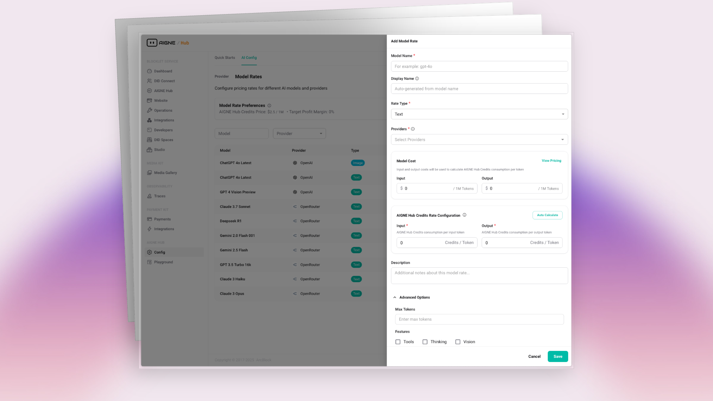

# 服务提供商模式

准备好提供您自己的多租户 AI 服务了吗？本指南详细介绍了如何在 AIGNE Hub 中激活服务提供商模式。您将学习如何启用基于积分的计费系统、集成 Payment Kit 以及定义自定义定价，从而为您的用户创建一个可盈利的 AI 网关。

服务提供商模式将 AIGNE Hub 从一个内部工具转变为一个功能齐全、面向客户的平台。它在核心功能的基础上增加了一个全面的计费和盈利层，允许您转售对各种 AI 模型的访问权限。这对于希望提供 AI 功能即服务的 SaaS 平台、代理机构和开发者来说是理想的选择。

有关在内部署 AIGNE Hub 的信息，请参阅[企业自托管](./deployment-scenarios-enterprise-self-hosting.md)文档。

## 工作原理

启用服务提供商模式后，AIGNE Hub 将基于预付费的积分系统运行。下图说明了其工作流程：

<!-- DIAGRAM_IMAGE_START:flowchart:16:9 -->

<!-- DIAGRAM_IMAGE_END -->

工作流程如下：

1.  **用户引导**：新用户会自动在系统中注册。您可以配置初始积分，让他们能够立即测试服务。
2.  **购买积分**：用户通过支付链接购买积分。此过程由 **Payment Kit** 管理，这是一个配套的 Blocklet，负责处理结账会话和支付处理。
3.  **使用 AI 模型**：用户向 AIGNE Hub 发起 API 调用，与各种 AI 模型进行交互。
4.  **扣除积分**：对于每次 API 调用，AIGNE Hub 会根据您自定义的模型费率计算成本，并从用户的积分余额中扣除相应金额。
5.  **用量跟踪**：所有交易都会被记录下来，为管理员和用户提供关于消耗和支出的详细分析。

该模型提供了一种灵活且可扩展的方式来管理多租户 AI 服务，确保用量得到准确和自动化的计费。

## 配置步骤

启用基于积分的计费系统需要安装 Payment Kit 并配置您的定价模型。

### 1. 安装 Payment Kit

Payment Kit 是一个独立的 Blocklet，与 AIGNE Hub 集成，用于处理所有与支付相关的功能，包括客户管理、积分购买和结账流程。

安装步骤：

1.  在您的 Blocklet Server 管理界面中，导航至**组件市场**。
2.  搜索 **"Payment Kit"**。
3.  点击**“启动”**并按照安装向导进行部署。

一旦 Payment Kit 运行起来，AIGNE Hub 将自动检测到它并启用必要的计费功能。

### 2. 定义自定义定价模型

启用计费系统后，您必须定义用户消耗的收费标准。这允许您设置自己的定价，其中可以包含在上游 AI 提供商成本之上的利润。

1.  在 AIGNE Hub 管理仪表盘中，导航至**配置** > **模型费率**。
2.  点击**“添加模型费率”**以打开配置模态框。
3.  通过填写必填字段来定义特定模型的定价：
    *   **模型名称**：模型的标识符（例如，`gpt-4o`）。
    *   **费率类型**：模型处理的内容类型（例如，文本、图像）。
    *   **提供商**：此模型的上游 AI 提供商。
    *   **模型成本**：您支付给提供商的实际成本。
    *   **AIGNE Hub 积分费率**：您向用户收取的积分价格。
    *   **描述**：模型费率的可选描述。

通过设置比实际成本更高的积分费率，您可以在每笔交易中产生利润。您可以为同一模型创建多个定价层级，或为不同的客户群体设置不同的费率。

### 3. 配置积分购买链接

为了让用户能够购买积分，您需要设置一个支付链接。Payment Kit 可以自动生成一个默认链接，或者您也可以创建一个自定义链接。

1.  安装 Payment Kit 后，会自动创建一个默认支付链接。您可以在 Payment Kit 的界面中找到并管理它。
2.  在 AIGNE Hub 管理仪表盘中，进入**计费与积分** > **设置**。
3.  在**积分支付链接**字段中输入您的积分购买页面 URL。当用户余额不足时，此链接将提供给他们。

此设置确保用户可以无缝地为自己的积分余额充值，并继续使用服务而不受中断。

## 管理用户积分

作为管理员，您可以完全控制用户的积分余额，并查看详细的交易历史。

### 查看用户余额

要查看用户的当前积分余额、待扣款项和已购买的总积分：

1.  在 AIGNE Hub 管理仪表盘中，导航至**用户**部分。
2.  从列表中选择一个用户以查看其详细信息。
3.  用户的积分信息将被显示出来，提供其账户状态的完整概览。

### 查看交易记录

AIGNE Hub 会记录每一笔消耗积分的交易。这包括聊天补全、图像生成和其他 AI 任务的 API 调用。

-   **积分授予**：记录所有添加到用户账户的积分，无论是通过购买还是手动授予。
-   **积分交易**：所有扣款的详细日志，显示使用了哪个 AI 模型、消耗的数量以及事件的时间戳。

您可以通过**计费与积分**部分访问这些日志，从而实现透明的审计并轻松解决任何计费查询。

## 总结

通过启用服务提供商模式，您可以利用 AIGNE Hub 强大的多提供商网关来构建和扩展您自己的可盈利 AI 服务。与 Payment Kit 的集成提供了一个强大、自动化的系统，用于管理基于积分的计费、自定义定价和用户消耗。

要深入了解如何监控消耗，请参阅[用量与成本分析](./features-analytics.md)指南。要了解如何管理上游提供商，请参阅[提供商管理](./features-provider-management.md)。