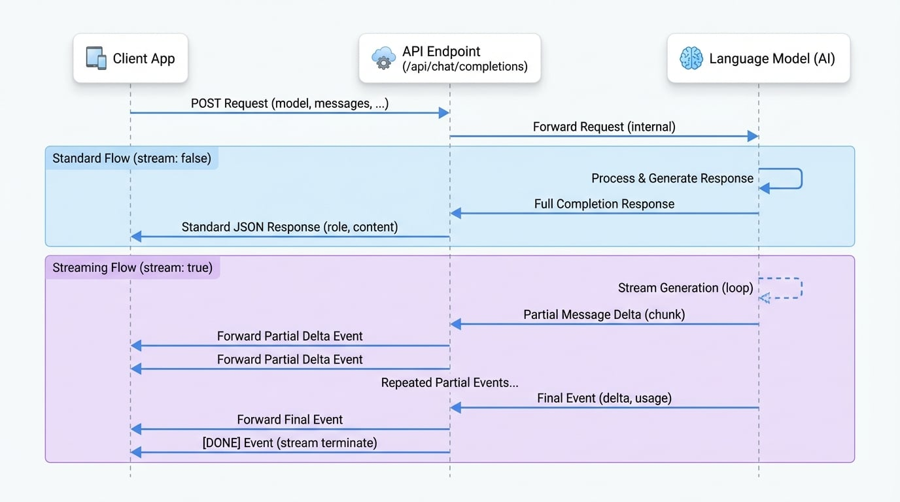

# 聊天补全

本文档提供了聊天补全 API 端点的详细规范。通过本指南，您将学会如何生成对话式 AI 响应、管理流式传输以及利用特定于模型的参数来构建稳健的应用程序。该端点是创建交互式、基于文本的体验的核心。

聊天补全 API 使您能够构建利用大型语言模型来完成各种对话任务的应用程序。您提供一系列消息作为输入，模型将返回一个基于文本的响应。

下图说明了标准和流式 API 调用的请求和响应流程：

<!-- DIAGRAM_IMAGE_START:sequence:16:9 -->

<!-- DIAGRAM_IMAGE_END -->

有关相关功能，请参阅[图像生成](./api-reference-image-generation.md)和[嵌入](./api-reference-embeddings.md) API 文档。

## 创建聊天补全

为给定的聊天对话创建模型响应。

`POST /api/chat/completions`

### 请求体

<x-field-group>
  <x-field data-name="model" data-type="string" data-required="true" data-default="gpt-3.5-turbo">
    <x-field-desc markdown>要使用的模型 ID。有关哪些模型适用于聊天 API 的详细信息，请参阅模型端点兼容性表。</x-field-desc>
  </x-field>
  <x-field data-name="messages" data-type="array" data-required="true">
    <x-field-desc markdown>构成迄今为止对话的消息列表。有关消息对象的结构，请参见下文。</x-field-desc>
    <x-field data-name="message" data-type="object">
      <x-field-desc markdown>每个消息对象必须包含 `role` 和 `content`。</x-field-desc>
      <x-field data-name="role" data-type="string" data-required="true">
        <x-field-desc markdown>消息作者的角色。可以是 `system`、`user`、`assistant` 或 `tool`。</x-field-desc>
      </x-field>
      <x-field data-name="content" data-type="string or array" data-required="true">
        <x-field-desc markdown>消息的内容。对于多模态模型，这可以是一个字符串或一个内容部分数组（例如，文本和图片 URL）。</x-field-desc>
      </x-field>
      <x-field data-name="name" data-type="string" data-required="false">
        <x-field-desc markdown>参与者的可选名称。为模型提供有关消息作者的上下文信息。</x-field-desc>
      </x-field>
      <x-field data-name="tool_calls" data-type="array" data-required="false">
        <x-field-desc markdown>由模型生成的工具调用，例如函数调用。</x-field-desc>
      </x-field>
      <x-field data-name="tool_call_id" data-type="string" data-required="false">
        <x-field-desc markdown>如果角色是 `tool` 则为必需项。此消息所响应的工具调用的 ID。</x-field-desc>
      </x-field>
    </x-field>
  </x-field>
  <x-field data-name="temperature" data-type="number" data-required="false" data-default="1">
    <x-field-desc markdown>控制随机性。降低该值会导致补全结果的随机性降低。当温度接近零时，模型将变得确定性和重复性。范围：`0` 到 `2`。</x-field-desc>
  </x-field>
  <x-field data-name="top_p" data-type="number" data-required="false" data-default="1">
    <x-field-desc markdown>通过核心采样控制多样性。`0.5` 表示只考虑所有按可能性加权的选项的一半。范围：`0.1` 到 `1`。</x-field-desc>
  </x-field>
  <x-field data-name="stream" data-type="boolean" data-required="false" data-default="false">
    <x-field-desc markdown>如果设置为 `true`，部分消息增量将作为服务器发送事件发送。流以 `data: [DONE]` 消息终止。</x-field-desc>
  </x-field>
  <x-field data-name="max_tokens" data-type="integer" data-required="false">
    <x-field-desc markdown>要生成的最大令牌数。输入令牌和生成令牌的总长度受模型上下文长度的限制。</x-field-desc>
  </x-field>
  <x-field data-name="presence_penalty" data-type="number" data-required="false" data-default="0">
    <x-field-desc markdown>介于 `-2.0` 和 `2.0` 之间的数字。正值会根据新令牌是否已在文本中出现来对其进行惩罚，从而增加模型谈论新主题的可能性。</x-field-desc>
  </x-field>
  <x-field data-name="frequency_penalty" data-type="number" data-required="false" data-default="0">
    <x-field-desc markdown>介于 `-2.0` 和 `2.0` 之间的数字。正值会根据新令牌在文本中已有的频率来对其进行惩罚，从而降低模型逐字重复同一行的可能性。</x-field-desc>
  </x-field>
  <x-field data-name="tools" data-type="array" data-required="false">
    <x-field-desc markdown>模型可能调用的工具列表。目前，仅支持函数作为工具。</x-field-desc>
  </x-field>
  <x-field data-name="tool_choice" data-type="string or object" data-required="false">
    <x-field-desc markdown>控制模型调用哪个工具（如果有）。可以是 `'none'`、`'auto'`、`'required'` 或指定要调用的函数的对象。</x-field-desc>
  </x-field>
  <x-field data-name="response_format" data-type="object" data-required="false">
    <x-field-desc markdown>一个指定模型必须输出格式的对象。设置为 `{ "type": "json_object" }` 可启用 JSON 模式。</x-field-desc>
  </x-field>
</x-field-group>

### 示例

#### 基本请求

此示例演示了与模型的简单对话。

```bash cURL 请求 icon=lucide:terminal
curl --location 'https://your-aigne-hub-instance.com/api/chat/completions' \
--header 'Authorization: Bearer YOUR_API_KEY' \
--header 'Content-Type: application/json' \
--data '{
    "model": "gpt-3.5-turbo",
    "messages": [
        {
            "role": "system",
            "content": "You are a helpful assistant."
        },
        {
            "role": "user",
            "content": "Hello! Can you explain what AIGNE Hub is in simple terms?"
        }
    ]
}'
```

#### 流式请求

要以事件流的形式接收响应，请将 `stream` 参数设置为 `true`。

```bash cURL 流式请求 icon=lucide:terminal
curl --location 'https://your-aigne-hub-instance.com/api/chat/completions' \
--header 'Authorization: Bearer YOUR_API_KEY' \
--header 'Content-Type: application/json' \
--header 'Accept: text/event-stream' \
--data '{
    "model": "gpt-3.5-turbo",
    "messages": [
        {
            "role": "user",
            "content": "Write a short story about a robot who discovers music."
        }
    ],
    "stream": true
}'
```

### 响应体

#### 标准响应

当 `stream` 为 `false` 或未设置时，将返回一个标准的 JSON 对象。

<x-field-group>
  <x-field data-name="role" data-type="string" data-desc="此消息作者的角色，始终为 'assistant'。"></x-field>
  <x-field data-name="content" data-type="string" data-desc="由模型生成的消息内容。"></x-field>
  <x-field data-name="tool_calls" data-type="array" data-required="false" data-desc="由模型生成的工具调用（如果有）。"></x-field>
</x-field-group>

**标准响应示例**

```json 响应体
{
  "role": "assistant",
  "content": "AIGNE Hub 是一个集中式网关，用于管理与来自不同提供商的各种 AI 模型的交互。它简化了 API 访问，处理计费和信用点数，并提供有关使用情况和成本的分析，充当组织 AI 服务的单一控制点。"
}
```

#### 流式响应

当 `stream` 为 `true` 时，API 返回一个 `text/event-stream` 数据块流。每个数据块都是一个 JSON 对象。

<x-field-group>
  <x-field data-name="delta" data-type="object" data-desc="消息增量的一个数据块。">
    <x-field data-name="role" data-type="string" data-required="false" data-desc="作者的角色，通常是 'assistant'。"></x-field>
    <x-field data-name="content" data-type="string" data-required="false" data-desc="消息的部分内容。"></x-field>
    <x-field data-name="tool_calls" data-type="array" data-required="false" data-desc="部分工具调用信息。"></x-field>
  </x-field>
  <x-field data-name="usage" data-type="object" data-desc="出现在最终数据块中，包含令牌使用情况统计。">
    <x-field data-name="prompt_tokens" data-type="integer" data-desc="提示中的令牌数。"></x-field>
    <x-field data-name="completion_tokens" data-type="integer" data-desc="生成的补全中的令牌数。"></x-field>
    <x-field data-name="total_tokens" data-type="integer" data-desc="请求中使用的总令牌数。"></x-field>
  </x-field>
</x-field-group>

**流式数据块示例**

```text 事件流
data: {"delta":{"role":"assistant","content":"Unit "}}

data: {"delta":{"content":"734,"}}

data: {"delta":{"content":" a sanitation "}}

data: {"delta":{"content":"and maintenance "}}

data: {"delta":{"content":"robot, hummed..."}}

data: {"usage":{"promptTokens":15,"completionTokens":100,"totalTokens":115}}

data: [DONE]
```

## 总结

聊天补全端点是将对话式 AI 集成到您应用程序中的强大工具。它通过各种参数（包括流式传输和工具使用）提供了灵活性，以支持广泛的用例。

有关其他可用 API 端点的更多信息，请参阅以下文档：

<x-cards data-columns="2">
  <x-card data-title="图像生成" data-icon="lucide:image" data-href="/api-reference/image-generation">
    了解如何使用 AI 模型生成和处理图像。
  </x-card>
  <x-card data-title="嵌入" data-icon="lucide:bot" data-href="/api-reference/embeddings">
    了解如何为机器学习任务创建文本的向量表示。
  </x-card>
</x-cards>