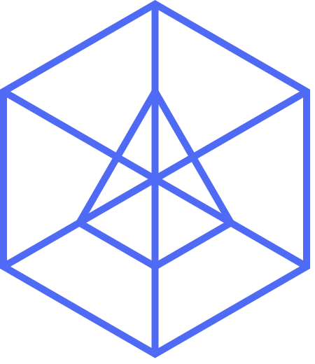

# Overview

AIGNE Hub is a unified AI gateway engineered to streamline the management of connections to a diverse array of Large Language Model (LLM) and AI-generated content (AIGC) providers. It abstracts the complexity of handling disparate API keys, monitors usage, and consolidates billing across multiple AI services. As a core component of the AIGNE ecosystem, it functions as the central nervous system for all generative AI operations, providing a robust and scalable backbone for applications built with the AIGNE framework, AIGNE Studio, or the AIGNE CLI.

## Key Features

AIGNE Hub is designed for operational excellence, providing DevOps, SRE, and infrastructure teams with the tools needed to deploy, manage, and monitor AI services efficiently and securely.

*   **Complete Control with Self-Hosting**: Deploy AIGNE Hub within your own infrastructure for full authority over data, security, and operations. This model ensures that all data remains within your security perimeter, aligning with strict corporate governance and compliance standards.
*   **Centralized Multi-Provider Access**: Integrate with over eight leading AI providers through a single, unified interface. This eliminates the need for multiple integration points, simplifies configuration management, and reduces the operational overhead of maintaining numerous service connections.
*   **Unified Security and Access Control**: Securely manage sensitive credentials with encrypted API key storage. AIGNE Hub provides fine-grained, role-based access controls, allowing you to enforce security policies and manage permissions across teams and applications from a central point.
*   **Comprehensive Usage Analytics**: Gain deep insights into AI service consumption with detailed tracking and cost analysis. Monitor usage patterns, track spending by provider or model, and optimize resource allocation to manage costs effectively.
*   **Flexible Billing and Service Monetization**: Operate the Hub for internal cost-tracking or deploy it as a customer-facing service. With its built-in credit system and integration with Payment Kit, you can set custom pricing, apply profit margins, and manage billing cycles for different user groups.
*   **Seamless AIGNE Ecosystem Integration**: AIGNE Hub is built to work out-of-the-box with the AIGNE framework, providing a frictionless development experience. Its architecture ensures that any application within the ecosystem can leverage its capabilities without complex configuration.

## Core Capabilities

AIGNE Hub provides a suite of robust, production-ready features accessible via a standardized RESTful API, designed for high-throughput and low-latency operations.

| Feature | Description |
| :--- | :--- |
|  **Chat Completions** | Provides access to conversational AI and advanced text generation models for a wide range of natural language processing tasks. |
|  **Image Generation** | Integrates with leading AI image generation and editing models, enabling dynamic creation and manipulation of visual content. |
|  **Embeddings** | Generates vector representations of text for use in semantic search, clustering, and other machine learning applications. |

## Supported AI Providers

AIGNE Hub supports a growing list of major AI providers, offering a wide selection of models to suit various performance and cost requirements. This multi-provider strategy ensures resilience and flexibility, allowing you to switch between models or providers without re-architecting your applications.

*   OpenAI (GPT models, DALL-E, Embeddings)
*   Anthropic (Claude models)
*   Amazon Bedrock
*   Google Gemini
*   DeepSeek
*   Ollama (Local model deployment)
*   OpenRouter
*   xAI (Grok models)
*   Doubao
*   Poe

## Deployment Scenarios

AIGNE Hub is architected to support two primary deployment models, catering to different organizational needs and operational contexts.

### Enterprise Self-Hosting

This scenario is optimized for organizations that require maximum control over their data and infrastructure.

*   **Deployment**: AIGNE Hub is deployed within your own private cloud or on-premises data center.
*   **Billing**: Your organization pays AI providers directly for resource consumption. All billing and usage data are managed internally, with no external service provider involvement.
*   **Data Privacy**: All data, including prompts, responses, and API keys, remains within your network perimeter, ensuring compliance with data sovereignty and privacy regulations.
*   **Use Case**: Ideal for internal development teams, corporate AI initiatives, and organizations with stringent data security requirements.

### Service Provider Mode

This model allows you to offer AI services to external customers, transforming AIGNE Hub into a multi-tenant, revenue-generating platform.

*   **Deployment**: Can be deployed in a public or private cloud, configured for multi-tenancy.
*   **Billing**: Leverages the built-in credit system, integrated with Payment Kit, to manage customer billing. You can set custom pricing, define profit margins, and automate user onboarding with starter credits.
*   **Management**: Provides a comprehensive suite of tools for managing customer accounts, tracking usage, and handling billing cycles.
*   **Use Case**: Perfect for AI service providers, SaaS platforms, and businesses looking to monetize access to a curated set of AI models.