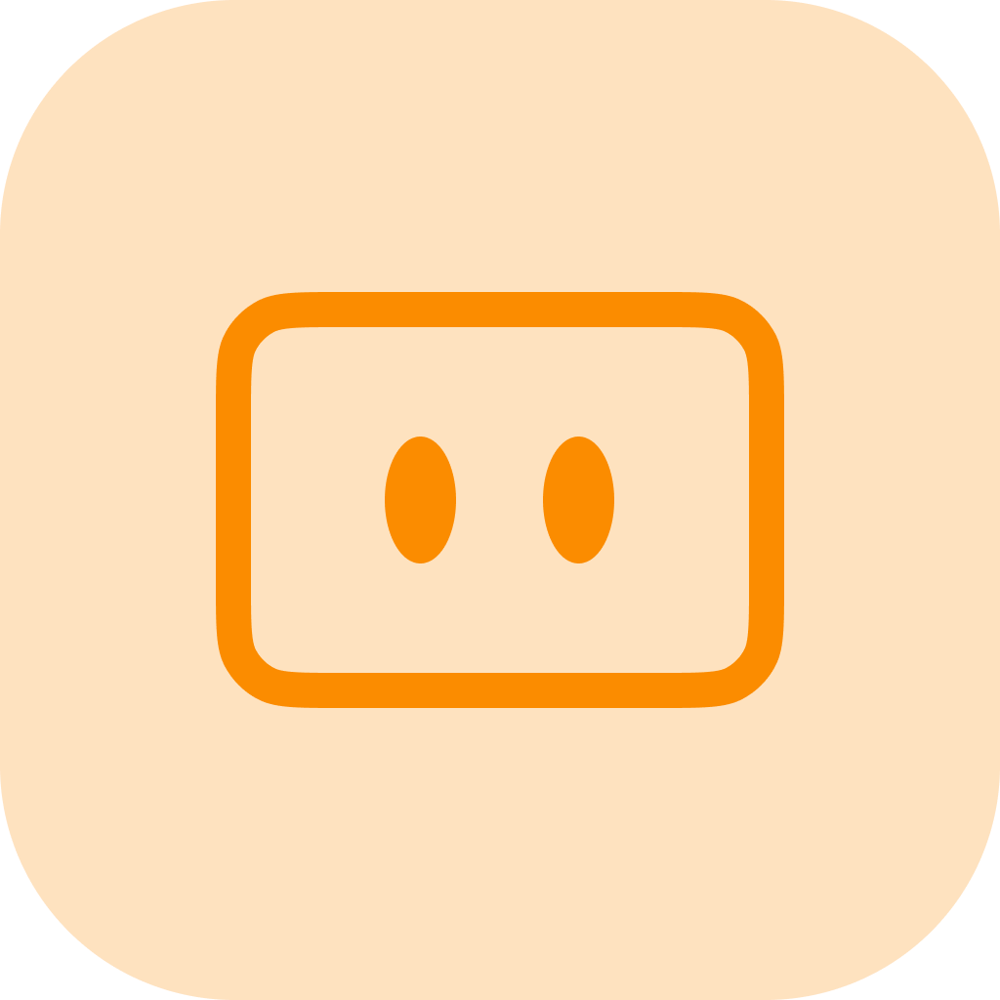

# 技術架構

AIGNE Hub 被設計為一個雲原生應用程式，為可靠性、可擴展性和易於維護進行了優化。該架構利用了現代化的技術堆疊，每個元件都經過精心挑選，以滿足高效能 AI 閘道的特定需求。該系統被設計為一個自足的單元進行部署，從而最大限度地減少了外部依賴，並簡化了營運管理。

### 核心元件

此架構由幾個關鍵層組成：

| 元件 | 技術 | 理由 |
| :--- | :--- | :--- |
| **應用程式框架** | AIGNE 框架 | 為後端服務提供基礎結構，包括依賴注入、組態管理和生命週期掛鉤。它標準化了開發流程，並確保在 AIGNE 生態系統內的無縫整合。 |
| **後端執行環境** | Node.js & TypeScript | Node.js 因其非阻塞、事件驅動的 I/O 模型而被採用，這對於處理大量對外部 LLM 供應商的並行 API 請求非常高效。TypeScript 增加了靜態型別，提高了程式碼品質、可維護性，並減少了執行階段錯誤——這對於核心基礎設施服務而言是一項至關重要的特性。 |
| **前端介面** | React 19 | 管理儀表板和模型遊樂場是使用最新版本的 React 構建的。這為組態、監控和測試提供了一個現代化、響應式且高效能的使用者介面。 |
| **資料儲存** | SQLite 搭配 Sequelize ORM | SQLite 被用作預設的嵌入式資料庫，這無需外部資料庫伺服器，從而簡化了部署。這一設計選擇使得 AIGNE Hub 輕量且易於安裝。Sequelize ORM 抽象化了資料庫互動，並提供了在必要時為更大規模部署切換到其他 SQL 資料庫（如 PostgreSQL）的靈活性。 |
| **部署與打包**| Blocklet | 整個應用程式被打包為一個 Blocklet。這種雲原生的容器化方法將應用程式、其執行環境和所有依賴項封裝到一個單一、可部署的單元中。對於營運團隊而言，這極大地簡化了在任何 Blocklet Server 實例上的安裝、升級和擴展。 |

### 系統設計與資料流程

1.  **請求接收**：客戶端應用程式（例如，使用 AIGNE 框架、AIGNE Studio 或自訂腳本構建的應用程式）向 AIGNE Hub 的 RESTful 端點（例如 `/api/v2/chat`）發送 API 請求。這些請求透過 OAuth 存取金鑰進行保護。
2.  **驗證與授權**：Hub 的閘道層攔截請求，驗證存取金鑰，並檢查相關權限和使用者信用餘額（如果在服務供應商模式下）。
3.  **供應商路由**：根據請求參數（例如 `model: "openai/gpt-3.5-turbo"`），Hub 的路由邏輯會選擇適當的下游 AI 供應商。
4.  **憑證注入**：Hub 從其加密儲存中安全地擷取相應供應商的 API 金鑰，並將其注入到請求中。
5.  **API 呼叫與回應**：Hub 將轉換後的請求轉發給目標 AI 供應商的 API。在收到回應後，它會將輸出正規化為標準化格式。
6.  **日誌記錄與分析**：在將回應返回給客戶端之前，Hub 會記錄交易詳情，包括 token 用量、成本和延遲。這些資料為用量分析和計費系統提供支援。
7.  **回應客戶端**：最終的標準化回應會被發送回客戶端應用程式。

此架構確保了 AIGNE Hub 作為一個強大且透明的中介，為組織內的所有 AI 操作集中了控制、安全性和可觀測性。Blocklet 技術的使用抽象化了底層基礎設施的複雜性，讓 DevOps 和 SRE 團隊能夠將 Hub 作為一個可預測、版本化且可擴展的服務進行管理。