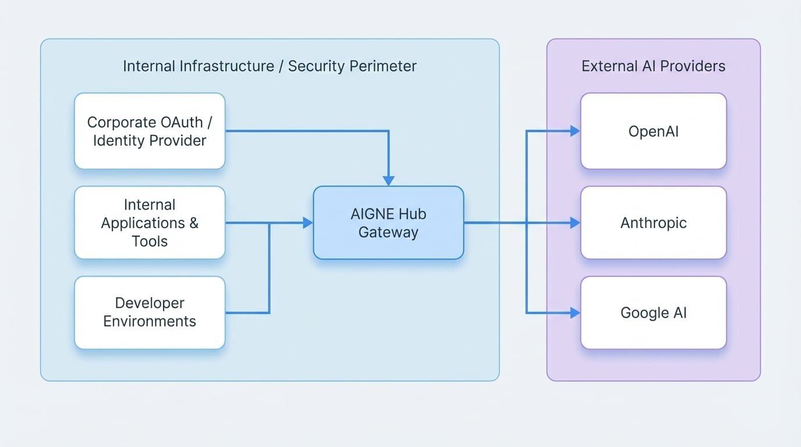

# 企业自托管

在您自己的基础设施内部署 AIGNE Hub，可以让您的组织完全控制 AI 模型访问、数据隐私和运营成本。本指南提供了一种结构化的方法，用于配置和管理自托管的 AIGNE Hub 实例，以实现安全的企业内部使用。

## 概览

企业自托管模型专为优先考虑数据安全和直接管理其 AI 资源的企业组织而设计。通过在您自己的网络边界内部署 AIGNE Hub，您可以为所有内部团队和应用程序创建一个集中、安全的网关，以访问各种 AI 模型。

这种方法具有几个明显的优势：

*   **增强安全性**：所有数据，包括提示、响应和 API 凭证，都保留在您的公司网络内，确保符合严格的数据隐私政策。
*   **直接计费**：您与每个 AI 提供商（例如 OpenAI、Anthropic、Google）保持直接的计费关系。AIGNE Hub 会跟踪使用情况，但所有费用都直接支付给供应商，从而简化了预算分配并消除了第三方计费的复杂性。
*   **完全控制**：您的团队对实例拥有完全的管理控制权，包括哪些模型可用、谁可以访问它们以及如何配置它们。
*   **内部集成**：将 AIGNE Hub 与您现有的内部身份验证系统（例如您的企业 OAuth 提供商）无缝连接，以实现统一和安全的访问管理。

此部署场景非常适合开发团队、企业 AI 计划以及任何需要对生成式 AI 功能进行稳健、私密访问的应用程序。

## 架构考量

当为企业内部使用部署 AIGNE Hub 时，它在您的安全边界内充当一个集中式网关。所有内部应用程序和服务都通过该 Hub 路由其 AI 请求，然后该 Hub 再与外部 AI 提供商进行安全通信。

下图说明了此架构：

<!-- DIAGRAM_IMAGE_START:architecture:16:9 -->

<!-- DIAGRAM_IMAGE_END -->

### 关键组件

*   **AIGNE Hub 实例**：在您的内部基础设施（例如，私有云、本地服务器或 VPC）上运行的专用 Blocklet。
*   **内部应用程序**：需要使用 AI 服务的您的服务、开发环境和内部工具。
*   **身份验证系统**：您的企业身份提供商（例如，内部 OAuth 2.0 服务器），用于管理用户访问。
*   **外部 AI 提供商**：AIGNE Hub 连接的上游 LLM 和 AIGC 服务。

在此配置中，Hub 充当唯一的中间人。内部应用程序不需要直接访问提供商的 API 密钥，这显著增强了您的安全态势。

## 配置步骤

为企业使用配置 AIGNE Hub 是一个直接的过程，重点在于连接提供商和保护访问。

### 1. 初始部署

首先，请确保您有一个正在运行的 AIGNE Hub 实例。如果您尚未安装，请遵循我们[入门指南](./getting-started.md)中的部署说明。主要方法是从 Blocklet Store 将其启动到您的 Blocklet Server 上。

### 2. 提供商配置

自托管设置的核心是配置 AIGNE Hub 以使用您组织自己的 API 密钥来访问每个 AI 提供商。这确保了所有使用情况都直接计入您的公司账户。

1.  导航到您的 AIGNE Hub 实例的管理仪表盘。
2.  在左侧边栏中，转到**配置 > AI 提供商**。
3.  在这里，您将看到支持的 AI 提供商列表。点击**+ 添加提供商**或选择一个现有的进行配置。
4.  为所选提供商输入您组织的 API 凭证。系统使用加密安全地存储这些凭证。
5.  启用您希望向内部用户提供的提供商。

### 3. 用户访问与安全

对于内部使用，您可以通过现有的身份基础设施来管理访问。

#### 内部 OAuth 集成

AIGNE Hub 支持标准的 OAuth 2.0，以实现安全的单点登录 (SSO) 访问。通过将其与您的内部身份提供商集成，员工可以使用他们的公司凭证访问 Hub 并为他们的应用程序生成 API 令牌。这集中了用户管理和访问控制。

要进行此配置，您需要在 AIGNE Hub 的安全设置中提供来自您的 OAuth 提供商的客户端 ID、客户端密钥和相关端点。

#### 直接 API 访问

对于服务或自动化工作流，管理员可以直接在 AIGNE Hub 内生成长期有效的 API 密钥。这些密钥可以被分配特定的权限，并可以随时撤销，为非交互式访问提供了一种安全的方法。

## 使用与管理

配置好自托管实例后，内部团队就可以开始使用统一的 API 端点来满足他们所有的 AI 需求。

### 统一 API 端点

所有对任何已配置 AI 模型的请求都将发送到您的 AIGNE Hub 实例的 API 端点。Hub 会使用安全存储的凭证，自动将请求路由到相应的上游提供商。

例如，一个应用程序可以从使用 OpenAI 的 `gpt-4` 切换到 Anthropic 的 `claude-3-opus`，只需在 API 调用中更改模型名称，而无需管理不同的 API 密钥或端点。

### 使用情况分析

尽管计费是直接与提供商处理的，但 AIGNE Hub 提供了关于使用情况和成本的详细分析。

*   在管理仪表盘中导航至**使用情况分析**部分。
*   监控每个用户、团队或应用程序的令牌消耗、图像生成数量和预估成本。
*   使用这些数据进行内部费用分摊、预算跟踪和识别高消耗服务。

这使您能够对整个组织的 AI 支出保持可见性，而无需解析单个提供商发票的复杂性。

## 总结

企业自托管模型为内部使用部署 AIGNE Hub 提供了一种安全、可控且高效的方式。通过集中化 AI 访问、将数据保留在您的安全边界内以及维持直接的计费关系，您可以构建一个满足严格企业要求的稳健 AI 基础设施。

有关更高级的配置，例如为外部客户设置盈利服务，请参阅[服务提供商模式](./deployment-scenarios-service-provider.md)文档。您还可以在[安全与访问](./features-security.md)指南中找到有关保护实例的详细信息。