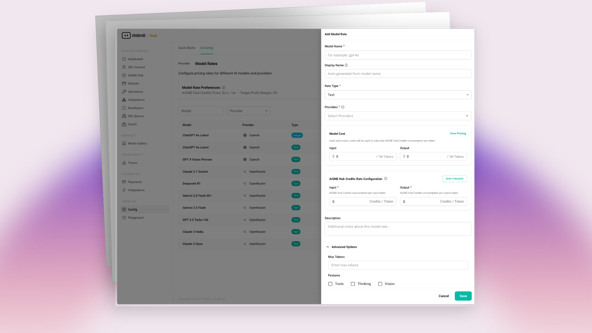

# 服務提供者模式

準備好提供您自己的多租戶 AI 服務了嗎？本指南詳細介紹如何在 AIGNE Hub 中啟用服務提供者模式。您將學習如何啟用基於點數的計費系統、整合 Payment Kit，並定義自訂定價，為您的使用者建立一個可營利的 AI 閘道。

服務提供者模式將 AIGNE Hub 從一個內部工具轉變為一個功能齊全、面向客戶的平台。它在核心功能的基礎上增加了一個全面的計費和營利層，讓您能夠轉售對各種 AI 模型的存取權限。這對於希望將 AI 功能作為服務提供的 SaaS 平台、代理商和開發者來說是理想的選擇。

有關為內部使用部署 AIGNE Hub 的資訊，請參閱 [企業自架](./deployment-scenarios-enterprise-self-hosting.md) 文件。

## 運作方式

當啟用服務提供者模式時，AIGNE Hub 會以預付的點數制系統運作。下圖說明了其工作流程：

```d2
direction: down

User: {
  shape: c4-person
}

Service-Provider-Platform: {
  label: "服務提供者平台"
  shape: rectangle

  AIGNE-Hub: {
    label: "AIGNE Hub"
    icon: "https://www.arcblock.io/image-bin/uploads/89a24f04c34eca94f26c9dd30aec44fc.png"
  }

  Payment-Kit: {
    label: "Payment Kit"
    shape: rectangle
  }
}

Upstream-AI-Providers: {
  label: "上游 AI 提供者"
  shape: rectangle

  OpenAI: { label: "OpenAI" }
  Claude: { label: "Claude" }
  Google: { label: "Google" }
  More: { label: "..." }
}

User -> Service-Provider-Platform.Payment-Kit: "1. 購買點數"
Service-Provider-Platform.Payment-Kit -> Service-Provider-Platform.AIGNE-Hub: "2. 更新點數餘額"
User -> Service-Provider-Platform.AIGNE-Hub: "3. 進行 API 呼叫\n（使用 AI 模型）"
Service-Provider-Platform.AIGNE-Hub -> Upstream-AI-Providers: "4. 轉發請求"
Upstream-AI-Providers -> Service-Provider-Platform.AIGNE-Hub: "5. 回傳回應"
Service-Provider-Platform.AIGNE-Hub -> Service-Provider-Platform.AIGNE-Hub: "6. 從使用者餘額中\n扣除點數"
Service-Provider-Platform.AIGNE-Hub -> User: "7. 將回應回傳給使用者"
```

工作流程如下：

1.  **使用者註冊**：新使用者會自動在系統中註冊。您可以設定起始點數，讓他們可以立即測試服務。
2.  **購買點數**：使用者透過付款連結購買點數。此過程由 **Payment Kit** 管理，它是一個配套的 Blocklet，負責處理結帳流程和付款事宜。
3.  **使用 AI 模型**：使用者向 AIGNE Hub 發出 API 呼叫，與各種 AI 模型互動。
4.  **扣除點數**：對於每次 API 呼叫，AIGNE Hub 會根據您自訂的模型費率計算成本，並從使用者的點數餘額中扣除相應的金額。
5.  **用量追蹤**：所有交易都會被記錄下來，為管理員和使用者提供關於消耗和支出的詳細分析。

此模型提供了一種靈活且可擴展的方式來管理多租戶 AI 服務，確保用量能夠被準確且自動地計費。



## 設定步驟

啟用基於點數的計費系統需要安裝 Payment Kit 並設定您的定價模型。

### 1. 安裝 Payment Kit

Payment Kit 是一個獨立的 Blocklet，它與 AIGNE Hub 整合，處理所有與支付相關的功能，包括客戶管理、點數購買和結帳流程。

安裝步驟：

1.  在您的 Blocklet Server 管理介面中，前往 **Blocklet Store**。
2.  搜尋 **"Payment Kit"**。
3.  點擊 **"Launch"** 並按照安裝精靈的指示進行部署。

一旦 Payment Kit 開始運行，AIGNE Hub 將自動偵測到它並啟用必要的計費功能。

### 2. 定義自訂定價模型

啟用計費系統後，您必須定義向使用者收取的消耗費率。這讓您可以設定自己的定價，其中可以包含在上游 AI 提供者成本之上的利潤。

1.  在 AIGNE Hub 管理儀表板中，前往 **Config** > **Model Rates**。
2.  點擊 **"Add Model Rate"** 開啟設定對話框。
3.  透過填寫必填欄位來定義特定模型的定價：
    *   **Model Name**：模型的識別碼（例如 `gpt-4o`）。
    *   **Rate Type**：模型處理的內容類型（例如 Text、Image）。
    *   **Providers**：此模型的上游 AI 提供者。
    *   **Model Cost**：您支付給提供者的實際成本。
    *   **AIGNE Hub Credit Rate**：您將向使用者收取的點數價格。
    *   **Description**：模型費率的選填描述。


透過設定比實際成本更高的點數費率，您可以在每筆交易中產生利潤。您可以為同一個模型建立多個定價層級，或根據需要為不同的客戶群組設定不同的費率。

### 3. 設定點數購買連結

為了讓使用者能夠購買點數，您需要設定一個付款連結。Payment Kit 可以自動產生一個預設連結，或者您也可以建立一個自訂連結。

1.  安裝 Payment Kit 時會自動建立一個預設的付款連結。您可以在 Payment Kit 的介面中找到並管理它。
2.  在 AIGNE Hub 管理儀表板中，前往 **Billing & Credits** > **Settings**。
3.  在 **Credit Payment Link** 欄位中輸入您的點數購買頁面 URL。當使用者餘額不足時，此連結將會提供給他們。

這樣的設定確保了使用者可以無縫地為其點數餘額儲值，並持續使用服務而不會中斷。

## 管理使用者點數

作為管理員，您對使用者的點數餘額擁有完全的控制權，並可以查看詳細的交易歷史記錄。

### 查看使用者餘額

要查看使用者的目前點數餘額、待扣除額和總購買點數：

1.  在 AIGNE Hub 管理儀表板中，前往 **Users** 區塊。
2.  從列表中選擇一位使用者以查看其詳細資訊。
3.  使用者的點數資訊將會顯示出來，提供其帳戶狀態的完整概覽。

### 檢閱交易

AIGNE Hub 會記錄每一筆消耗點數的交易。這包括用於聊天完成、圖片生成和其他 AI 任務的 API 呼叫。

-   **Credit Grants**：所有新增至使用者帳戶的點數記錄，無論是透過購買還是手動授予。
-   **Credit Transactions**：所有扣款的詳細日誌，顯示使用了哪個 AI 模型、消耗的數量以及事件的時間戳。

您可以透過 **Billing & Credits** 區塊存取這些日誌，從而實現透明的審計並輕鬆解決任何計費查詢。

## 總結

透過啟用服務提供者模式，您可以利用 AIGNE Hub 強大的多提供者閘道來建立和擴展您自己的營利性 AI 服務。與 Payment Kit 的整合提供了一個強大且自動化的系統，用於管理基於點數的計費、自訂定價和使用者消耗。

要更深入地了解如何監控消耗情況，請參閱 [用量與成本分析](./features-analytics.md) 指南。要了解如何管理上游提供者，請參閱 [提供者管理](./features-provider-management.md)。