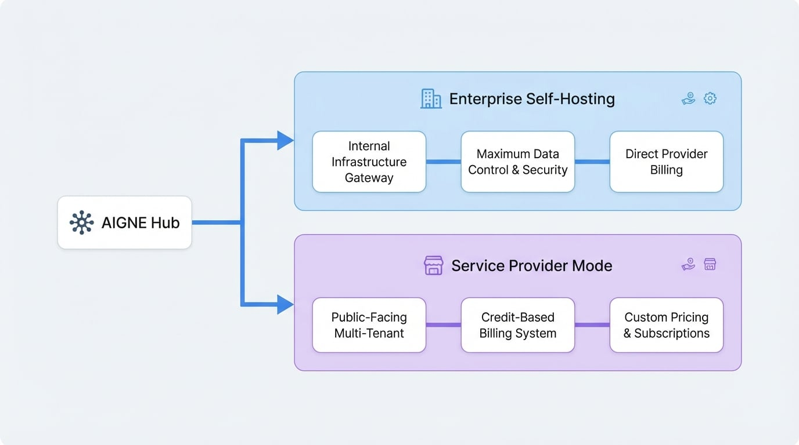

# デプロイシナリオ

AIGNE Hub を特定の運用上およびビジネス上の目標に合わせるためには、適切なデプロイモデルを選択することが重要です。このドキュメントでは、利用可能な2つの主要なデプロイシナリオを概説し、アーキテクチャの決定を導くための明確な比較を提供します。各モードは、社内での利用から一般向けの商用サービスまで、それぞれ異なるユースケースに対応するように設計されています。

AIGNE Hub は、社内企業向けのセルフホストゲートウェイとして、または組み込みのクレジットおよび請求システムを備えたマルチテナントサービスプロバイダープラットフォームとして、2つの主要なモードのいずれかでデプロイできる柔軟性を提供します。選択されたモードによって、請求、ユーザー管理、およびセキュリティの構成が決まります。

以下の図は、2つのデプロイモデルの概要比較です。

<!-- DIAGRAM_IMAGE_START:architecture:16:9 -->

<!-- DIAGRAM_IMAGE_END -->

以下のセクションでは、各デプロイシナリオの概要を説明します。詳細な設定手順については、特定のサブドキュメントを参照してください。

## デプロイモデル

AIGNE Hub は、それぞれ異なる組織のニーズに合わせて調整された2つの異なる運用モードをサポートしています。以下は、各モデルとその対象となるユースケースの概要です。

<x-cards data-columns="2">
  <x-card data-title="エンタープライズセルフホスティング" data-icon="lucide:building-2" data-href="/deployment-scenarios/enterprise-self-hosting">
    社内チーム向けの中央集権型ゲートウェイとして、独自のインフラストラクチャ内に AIGNE Hub をデプロイします。このモデルは、データとセキュリティを最大限に制御し、請求は組織と上流の AI プロバイダー間で直接処理されます。
  </x-card>
  <x-card data-title="サービスプロバイダーモード" data-icon="lucide:store" data-href="/deployment-scenarios/service-provider">
    AIGNE Hub を一般公開され、収益化された AI サービスとして機能するように構成します。このモードでは、クレジットベースの請求システムが有効になり、カスタム価格の設定、ユーザーサブスクリプションの管理、AI サービスからの収益生成が可能になります。
  </x-card>
</x-cards>

## まとめ

このドキュメントでは、AIGNE Hub の2つの主要なデプロイシナリオを紹介しました。エンタープライズセルフホスティングモデルは、セキュリティと直接請求を優先する社内利用に最適です。対照的に、サービスプロバイダーモードは、マルチテナンシーと収益化を必要とする一般公開サービス向けに設計されています。

詳細な実装ガイドについては、関連するセクションに進んでください。
- **[エンタープライズセルフホスティング](./deployment-scenarios-enterprise-self-hosting.md)**
- **[サービスプロバイダーモード](./deployment-scenarios-service-provider.md)**