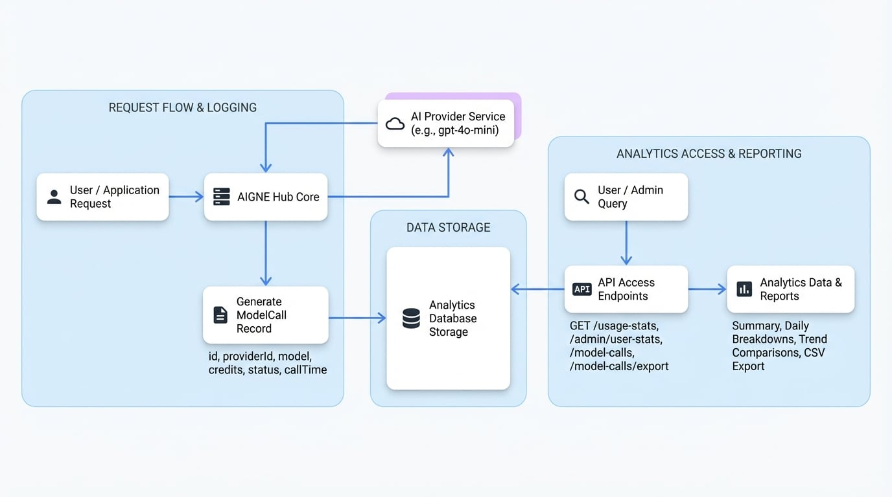

# 使用状況とコストの分析

AI モデルの消費量を把握することは、コスト管理、パフォーマンス監視、そして公正なリソース割り当てを確実にするために不可欠です。このドキュメントでは、使用統計のクエリ方法、コストの追跡方法、そして AIGNE Hub が分析とレポートに使用するデータモデルの解釈方法について詳しく説明します。

## 概要

AIGNE Hub は、すべての API インタラクションを `ModelCall` エントリとして記録します。これらの記録は、すべての使用状況分析の基礎となります。システムは、このデータをクエリして集計するためのいくつかの API エンドポイントを提供しており、システム全体またはユーザーごとの消費量を監視できます。これにより、トークンの使用状況、クレジットの消費量、および全体的な API コール量を詳細に追跡できます。

## データモデル

分析データを効果的にクエリし、解釈するためには、基礎となるデータ構造を理解することが不可欠です。以下の図は、`ModelCall` レコードがどのように生成され、分析エンドポイントによって使用されるかを示しています。

<!-- DIAGRAM_IMAGE_START:architecture:16:9 -->

<!-- DIAGRAM_IMAGE_END -->

### `ModelCall` オブジェクト

ハブを介して AI プロバイダーに行われたすべてのリクエストは、`ModelCall` として記録されます。このオブジェクトには、リクエスト、その実行、および関連するコストに関する詳細情報が含まれています。

<x-field-group>
  <x-field data-name="id" data-type="string" data-required="true" data-desc="モデルコールレコードの一意の識別子。"></x-field>
  <x-field data-name="providerId" data-type="string" data-required="true" data-desc="コールに使用された AI プロバイダーの識別子。"></x-field>
  <x-field data-name="model" data-type="string" data-required="true" data-desc="呼び出された特定のモデル (例: 'gpt-4o-mini')。"></x-field>
  <x-field data-name="credentialId" data-type="string" data-required="true" data-desc="プロバイダーとの認証に使用された認証情報の ID。"></x-field>
  <x-field data-name="type" data-type="string" data-required="true" data-desc="API コールのタイプ。可能な値は 'chatCompletion'、'embedding'、'imageGeneration'、'audioGeneration'、'video'、または 'custom' です。"></x-field>
  <x-field data-name="totalUsage" data-type="number" data-required="true" data-desc="正規化された使用量メトリック。テキストモデルの場合、これは通常、トークンの総数 (入力 + 出力) です。"></x-field>
  <x-field data-name="usageMetrics" data-type="object" data-required="false" data-desc="入力トークンや出力トークンなど、使用量の詳細な内訳。">
    <x-field data-name="inputTokens" data-type="number" data-desc="入力プロンプトのトークン数。"></x-field>
    <x-field data-name="outputTokens" data-type="number" data-desc="生成されたレスポンスのトークン数。"></x-field>
  </x-field>
  <x-field data-name="credits" data-type="number" data-required="true" data-desc="設定されたモデルレートに基づき、コールによって消費されたクレジット数。"></x-field>
  <x-field data-name="status" data-type="string" data-required="true" data-desc="コールの最終ステータス。「success」または「failed」になります。"></x-field>
  <x-field data-name="duration" data-type="number" data-required="false" data-desc="API コールの所要時間 (秒)。"></x-field>
  <x-field data-name="errorReason" data-type="string" data-required="false" data-desc="コールが失敗した場合、このフィールドには失敗の理由が含まれます。"></x-field>
  <x-field data-name="appDid" data-type="string" data-required="false" data-desc="コールを開始したアプリケーションの DID。"></x-field>
  <x-field data-name="userDid" data-type="string" data-required="true" data-desc="コールを行ったユーザーの DID。"></x-field>
  <x-field data-name="requestId" data-type="string" data-required="false" data-desc="トレース用のオプションのクライアント側リクエスト識別子。"></x-field>
  <x-field data-name="callTime" data-type="number" data-required="true" data-desc="コールが行われたときの Unix タイムスタンプ。"></x-field>
  <x-field data-name="createdAt" data-type="string" data-required="true" data-desc="レコードがデータベースに作成されたときのタイムスタンプ。"></x-field>
</x-field-group>

## 使用状況データのクエリ

いくつかの REST API エンドポイントを介して分析データを取得できます。これらのエンドポイントには認証が必要です。

### 使用統計の取得

特定の期間の使用状況を要約および集計して表示するには、`GET /api/user/usage-stats` エンドポイントを使用します。システム全体の分析については、管理者は `GET /api/user/admin/user-stats` を使用できます。

**リクエストパラメータ**

<x-field-group>
  <x-field data-name="startTime" data-type="string" data-required="true" data-desc="期間の開始を示す Unix タイムスタンプ。"></x-field>
  <x-field data-name="endTime" data-type="string" data-required="true" data-desc="期間の終了を示す Unix タイムスタンプ。"></x-field>
  <x-field data-name="allUsers" data-type="boolean" data-required="false">
    <x-field-desc markdown>`/api/user/model-calls` を使用する際、すべてのユーザーのデータを取得するには `true` に設定します。これは管理者ユーザーに制限されています。</x-field-desc>
  </x-field>
</x-field-group>

**リクエスト例**

```bash ユーザー統計のリクエスト icon=lucide:terminal
curl -X GET 'https://your-aigne-hub-url/api/user/usage-stats?startTime=1672531200&endTime=1675228799' \
--header 'Authorization: Bearer <YOUR_ACCESS_TOKEN>'
```

**レスポンスボディ**

このエンドポイントは、概要、日ごとの内訳、モデル統計、およびトレンド比較を含む包括的なオブジェクトを返します。

<x-field-group>
  <x-field data-name="summary" data-type="object" data-desc="指定された期間の集計合計を含むオブジェクト。">
    <x-field data-name="totalCredits" data-type="number" data-desc="消費された合計クレジット数。"></x-field>
    <x-field data-name="totalCalls" data-type="number" data-desc="API コールの総数。"></x-field>
    <x-field data-name="modelCount" data-type="number" data-desc="使用されたユニークなモデルの総数。"></x-field>
    <x-field data-name="byType" data-type="object" data-desc="コールタイプ (例: 'chatCompletion') ごとに分類された使用統計情報を持つオブジェクト。">
      <x-field data-name="[callType]" data-type="object">
        <x-field data-name="totalUsage" data-type="number" data-desc="このタイプの合計使用量 (例: トークン)。"></x-field>
        <x-field data-name="totalCredits" data-type="number" data-desc="このタイプで消費された合計クレジット数。"></x-field>
        <x-field data-name="totalCalls" data-type="number" data-desc="このタイプのコール総数。"></x-field>
        <x-field data-name="successCalls" data-type="number" data-desc="このタイプの成功したコール数。"></x-field>
      </x-field>
    </x-field>
  </x-field>
  <x-field data-name="dailyStats" data-type="array" data-desc="各日の使用統計を表すオブジェクトの配列。">
    <x-field data-name="date" data-type="string" data-desc="日付 ('YYYY-MM-DD' 形式)。"></x-field>
    <x-field data-name="credits" data-type="number" data-desc="この日に消費された合計クレジット数。"></x-field>
    <x-field data-name="tokens" data-type="number" data-desc="この日に処理された合計トークン数。"></x-field>
    <x-field data-name="requests" data-type="number" data-desc="この日に行われた API コールの総数。"></x-field>
  </x-field>
  <x-field data-name="modelStats" data-type="array" data-desc="最も頻繁に使用されたモデルをリストする配列。">
    <x-field data-name="providerId" data-type="string" data-desc="モデルのプロバイダーの ID。"></x-field>
    <x-field data-name="model" data-type="string" data-desc="モデルの名前。"></x-field>
    <x-field data-name="totalCalls" data-type="number" data-desc="このモデルに対して行われたコールの総数。"></x-field>
  </x-field>
  <x-field data-name="trendComparison" data-type="object" data-desc="現在と前の期間の使用状況の比較。">
    <x-field data-name="current" data-type="object" data-desc="現在の期間の統計。"></x--field>
    <x-field data-name="previous" data-type="object" data-desc="同等の前の期間の統計。"></x-field>
    <x-field data-name="growth" data-type="object" data-desc="2つの期間の間の成長率。"></x-field>
  </x-field>
</x-field-group>

### モデルコールのリスト表示

個々の API リクエストの詳細な時系列ログについては、`GET /api/user/model-calls` エンドポイントを使用します。これにより、ページネーションとフィルタリングを備えた生の `ModelCall` レコードにアクセスできます。

**リクエストパラメータ**

<x-field-group>
  <x-field data-name="page" data-type="number" data-required="false" data-default="1" data-desc="ページネーション用のページ番号。"></x-field>
  <x-field data-name="pageSize" data-type="number" data-required="false" data-default="50" data-desc="1ページあたりに返すアイテムの数。最大は 100 です。"></x-field>
  <x-field data-name="startTime" data-type="string" data-required="false" data-desc="期間の開始を示す Unix タイムスタンプ。"></x-field>
  <x-field data-name="endTime" data-type="string" data-required="false" data-desc="期間の終了を示す Unix タイムスタンプ。"></x-field>
  <x-field data-name="search" data-type="string" data-required="false" data-desc="モデル名、アプリケーション DID、またはユーザー DID で結果をフィルタリングするための検索語。"></x-field>
  <x-field data-name="status" data-type="string" data-required="false" data-desc="コールステータスでフィルタリングします。「success」、「failed」、または「all」が指定できます。"></x-field>
  <x-field data-name="model" data-type="string" data-required="false" data-desc="特定のモデル名でフィルタリングします。"></x-field>
  <x-field data-name="providerId" data-type="string" data-required="false" data-desc="特定のプロバイダー ID でフィルタリングします。"></x-field>
  <x-field data-name="appDid" data-type="string" data-required="false" data-desc="特定のアプリケーション DID でフィルタリングします。"></x-field>
  <x-field data-name="allUsers" data-type="boolean" data-required="false" data-desc="true の場合、すべてのユーザーのモデルコールを返します (管理者のみ)。"></x-field>
</x-field-group>

**リクエスト例**

```bash モデルコールのリスト表示 icon=lucide:terminal
curl -X GET 'https://your-aigne-hub-url/api/user/model-calls?page=1&pageSize=10&status=failed' \
--header 'Authorization: Bearer <YOUR_ACCESS_TOKEN>'
```

**レスポンスボディ**

レスポンスは、ページ分割された `ModelCall` オブジェクトのリストです。

```json response.json
{
  "count": 1,
  "list": [
    {
      "id": "z8VwXGf6k3qN...",
      "providerId": "openai",
      "model": "gpt-4o-mini",
      "credentialId": "z3tXy..._default",
      "type": "chatCompletion",
      "totalUsage": 150,
      "usageMetrics": {
        "inputTokens": 100,
        "outputTokens": 50
      },
      "credits": 0.0002,
      "status": "failed",
      "duration": 2,
      "errorReason": "API key is invalid.",
      "appDid": "z2qa9sD2tFAP...",
      "userDid": "z1...",
      "requestId": null,
      "callTime": 1675228799,
      "createdAt": "2023-01-31T23:59:59.000Z",
      "updatedAt": "2023-01-31T23:59:59.000Z",
      "traceId": null,
      "provider": {
        "id": "openai",
        "name": "openai",
        "displayName": "OpenAI",
        "baseUrl": "https://api.openai.com/v1",
        "region": null,
        "enabled": true
      },
      "appInfo": {
        "appName": "My AI App",
        "appDid": "z2qa9sD2tFAP...",
        "appLogo": "...",
        "appUrl": "..."
      },
      "userInfo": {
        "did": "z1...",
        "fullName": "John Doe",
        "email": "john.doe@example.com",
        "avatar": "..."
      }
    }
  ],
  "paging": {
    "page": 1,
    "pageSize": 10
  }
}
```

### モデルコールのエクスポート

`GET /api/user/model-calls/export` エンドポイントを使用して、オフラインでの分析やレポート作成のためにモデルコールの履歴を CSV ファイルにエクスポートできます。このエンドポイントは、リスト表示エンドポイントと同じフィルタリングパラメータを受け入れます。

**リクエスト例**

```bash モデルコールのエクスポート icon=lucide:terminal
curl -X GET 'https://your-aigne-hub-url/api/user/model-calls/export?startTime=1672531200&endTime=1675228799' \
--header 'Authorization: Bearer <YOUR_ACCESS_TOKEN>' \
-o model-calls-export.csv
```

サーバーは、リクエストされたデータを含む `text/csv` ファイルで応答します。

## まとめ

AIGNE Hub の分析機能は、AI モデルの使用状況を監視し理解するための強力なツールを提供します。`ModelCall` データモデルと関連する API エンドポイントを活用することで、ダッシュボードの構築、レポートの生成、および運用コストとパフォーマンスに関する重要な洞察を得ることができます。

クレジットの設定と請求方法の詳細については、[サービスプロバイダーモード](./deployment-scenarios-service-provider.md)のドキュメントを参照してください。