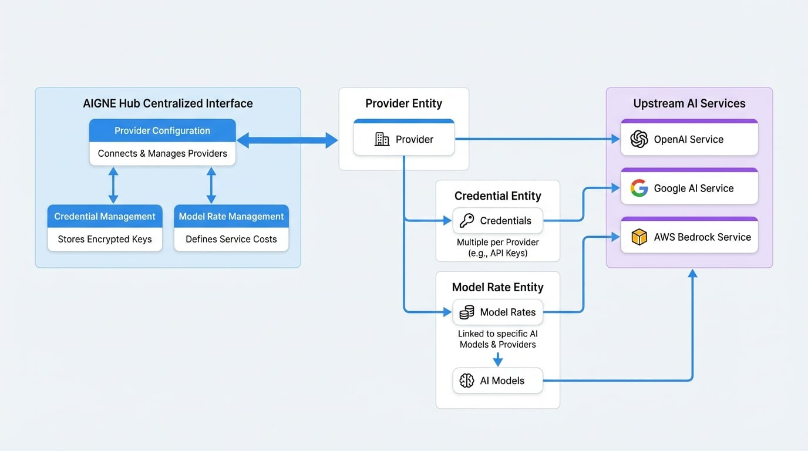

# プロバイダー管理

信頼性が高くコスト効率の良い AI ゲートウェイを維持するには、上流の AI プロバイダーの効果的な管理が不可欠です。AIGNE Hub はこのプロセスを一元化し、さまざまな AI サービスの認証情報を接続、設定、管理するための統一されたインターフェースを提供します。このセクションでは、プロバイダーの設定、認証情報、およびモデル料金の取り扱い手順について詳しく説明します。

以下の図は、AIGNE Hub 内でプロバイダー、認証情報、モデル料金がどのように相互接続されているかを示しています。

<!-- DIAGRAM_IMAGE_START:architecture:16:9 -->

<!-- DIAGRAM_IMAGE_END -->

## プロバイダーの設定

プロバイダーは、AIGNE Hub を OpenAI、Google、AWS Bedrock などの上流の AI サービスに接続するための基本的な要素です。適切な設定により、ハブはリクエストを適切なサービスにルーティングできます。

### プロバイダーの追加

新しい AI サービスを統合するには、それをプロバイダーとして追加する必要があります。各プロバイダーには、一意の名前、UI に表示される表示名、および `baseUrl` や `region` などのサービス固有の詳細が必要です。

#### リクエストボディ

<x-field-group>
  <x-field data-name="name" data-type="string" data-required="true">
    <x-field-desc markdown>プロバイダーの公式名。サポートされているプロバイダー値のいずれかである必要があります (例: `openai`、`google`、`bedrock`)。</x-field-desc>
  </x-field>
  <x-field data-name="displayName" data-type="string" data-required="true">
    <x-field-desc markdown>UI に表示される、プロバイダーの分かりやすい名前。</x-field-desc>
  </x-field>
  <x-field data-name="baseUrl" data-type="string" data-required="false">
    <x-field-desc markdown>プロバイダーの API エンドポイントのベース URL。ほとんどのプロバイダーで必須ですが、AWS Bedrock ではオプションです。</x-field-desc>
  </x-field>
  <x-field data-name="region" data-type="string" data-required="false">
    <x-field-desc markdown>Bedrock サービスの AWS リージョン。`bedrock` プロバイダーの場合のみ必須です。</x-field-desc>
  </x-field>
  <x-field data-name="enabled" data-type="boolean" data-default="true" data-required="false">
    <x-field-desc markdown>プロバイダーを有効または無効にします。無効化されたプロバイダーはリクエストのルーティングに使用されません。</x-field-desc>
  </x-field>
</x-field-group>

### プロバイダーの更新

既存のプロバイダーの設定（`baseUrl`、`region`、`enabled` ステータスなど）を変更できます。

#### リクエストボディ

<x-field-group>
  <x-field data-name="baseUrl" data-type="string" data-required="false">
    <x-field-desc markdown>プロバイダーの API エンドポイントの更新されたベース URL。</x-field-desc>
  </x-field>
  <x-field data-name="region" data-type="string" data-required="false">
    <x-field-desc markdown>Bedrock サービスの更新された AWS リージョン。</x-field-desc>
  </x-field>
  <x-field data-name="enabled" data-type="boolean" data-required="false">
    <x-field-desc markdown>プロバイダーの新しいステータス。</x-field-desc>
  </x-field>
</x-field-group>

### プロバイダーの一覧表示と削除

設定されているすべてのプロバイダーのリストを取得したり、ID で特定のプロバイダーを削除したりできます。プロバイダーを削除すると、関連するすべての認証情報とモデル料金も削除されます。

## 認証情報管理

認証情報は、上流の AI プロバイダーでの認証に使用されます。AIGNE Hub はこれらの認証情報を暗号化して安全に保存し、特定のプロバイダーに関連付けます。各プロバイダーは複数の認証情報を持つことができ、これによりキーのローテーションや負荷分散が可能になります。

### 認証情報の追加

認証情報を追加する際には、そのタイプと値を指定する必要があります。AIGNE Hub は、プロバイダーのサービスに対して認証情報を自動的に検証し、それがアクティブであることを確認します。

#### リクエストボディ

<x-field-group>
  <x-field data-name="name" data-type="string" data-required="true">
    <x-field-desc markdown>認証情報の説明的な名前 (例: 「チーム A の API キー」)。</x-field-desc>
  </x-field>
  <x-field data-name="credentialType" data-type="string" data-default="api_key" data-required="false">
    <x-field-desc markdown>認証情報のタイプ。サポートされている値は `api_key` および `access_key_pair` です。</x-field-desc>
  </x-field>
  <x-field data-name="value" data-type="string or object" data-required="true">
    <x-field-desc markdown>認証情報の値。`api_key` の場合は文字列です。`access_key_pair` の場合は `access_key_id` と `secret_access_key` を含むオブジェクトです。</x-field-desc>
  </x-field>
</x-field-group>

### 認証情報の検証

AIGNE Hub には、保存されている認証情報の有効性を確認するためのエンドポイントが含まれています。このアクションは、指定された認証情報を使用してプロバイダーへのテスト接続をトリガーし、それがアクティブであり、必要な権限を持っていることを確認します。

### 認証情報の更新と削除

既存の認証情報は、新しい値で更新したり、削除したりできます。認証情報が削除されると、システムから永久に削除され、リクエストには使用できなくなります。

## モデル料金管理

モデル料金は、AIGNE Hub クレジットで特定の AI モデルを使用するためのコストを定義します。これらの料金は、クレジットに基づいて使用量が請求される[サービスプロバイダーモード](./deployment-scenarios-service-provider.md)で運用されるシステムにとって不可欠です。

### モデル料金の追加

設定済みのプロバイダーがサポートする任意のモデルに対して料金を定義できます。これには、入力トークンと出力トークン（テキストモデルの場合）や、画像/ビデオごと（生成モデルの場合）に別々のクレジットコストを設定することが含まれます。

#### リクエストボディ

<x-field-group>
  <x-field data-name="model" data-type="string" data-required="true">
    <x-field-desc markdown>モデルの識別子 (例: `gpt-4o-mini`)。</x-field-desc>
  </x-field>
  <x-field data-name="type" data-type="string" data-required="true">
    <x-field-desc markdown>サービスの種類。サポートされている値は `chatCompletion`、`imageGeneration`、`embedding`、`video` です。</x-field-desc>
  </x-field>
  <x-field data-name="providers" data-type="array" data-required="true">
    <x-field-desc markdown>このモデル料金が適用されるプロバイダー ID の配列。これにより、単一のモデルを複数のプロバイダーが提供できます。</x-field-desc>
  </x-field>
  <x-field data-name="inputRate" data-type="number" data-required="true">
    <x-field-desc markdown>入力に対するクレジット単位のコスト (例: 1,000 トークンあたり)。</x-field-desc>
  </x-field>
  <x-field data-name="outputRate" data-type="number" data-required="true">
    <x-field-desc markdown>出力に対するクレジット単位のコスト (例: 1,000 トークンあたり)。</x-field-desc>
  </x-field>
  <x-field data-name="unitCosts" data-type="object" data-required="false">
    <x-field-desc markdown>プロバイダーからの百万ユニット（トークン/画像）あたりの実際のコスト（USD）。利益率に基づく自動料金計算に使用されます。</x-field-desc>
    <x-field data-name="input" data-type="number" data-required="true" data-desc="百万ユニットあたりの入力コスト。"></x-field>
    <x-field data-name="output" data-type="number" data-required="true" data-desc="百万ユニットあたりの出力コスト。"></x-field>
  </x-field>
  <x-field data-name="modelMetadata" data-type="object" data-required="false">
    <x-field-desc markdown>モデルの能力に関する追加のメタデータ。</x-field-desc>
    <x-field data-name="maxTokens" data-type="number" data-required="false" data-desc="最大コンテキストウィンドウサイズ。"></x-field>
    <x-field data-name="features" data-type="array" data-required="false" data-desc="`tools` や `vision` など、サポートされている機能の配列。"></x-field>
  </x-field>
</x-field-group>

### モデル料金の一括更新

価格調整を簡素化するため、AIGNE Hub は定義された利益率とクレジット価格に基づくモデル料金の一括更新をサポートしています。システムは、`unitCosts` が定義されているすべてのモデルの `inputRate` と `outputRate` を自動的に再計算します。

計算は以下の通りです：
`新しい料金 = (ユニットコスト * (1 + 利益率 / 100)) / クレジット価格`

#### リクエストボディ

<x-field-group>
  <x-field data-name="profitMargin" data-type="number" data-required="true">
    <x-field-desc markdown>希望する利益率をパーセンテージで指定します (例: 20% の場合は `20`)。</x-field-desc>
  </x-field>
  <x-field data-name="creditPrice" data-type="number" data-required="true">
    <x-field-desc markdown>1 クレジットあたりの価格（USD）。</x-field-desc>
  </x-field>
</x-field-group>

### モデル料金の更新と削除

個々のモデル料金は変更または削除できます。モデル料金が削除されると、クレジットベースの課金が有効な場合、対応するモデルはユーザーに利用できなくなります。

## まとめ

このセクションでは、AIGNE Hub 内で AI プロバイダー、認証情報、モデル料金を管理するための主要な機能について説明しました。これらのリソースを適切に設定することは、AI サービスのセキュリティ、信頼性、および財務管理にとって不可欠です。

関連トピックの詳細については、以下のセクションを参照してください。
<x-cards data-columns="2">
  <x-card data-title="サービスプロバイダーモード" data-href="/deployment-scenarios/service-provider" data-icon="lucide:briefcase">クレジットベースの課金とカスタム価格モデルの設定方法について学びます。</x-card>
  <x-card data-title="セキュリティとアクセス制御" data-href="/features/security" data-icon="lucide:shield">暗号化ストレージやアクセス制御など、セキュリティアーキテクチャについて理解します。</x-card>
</x-cards>