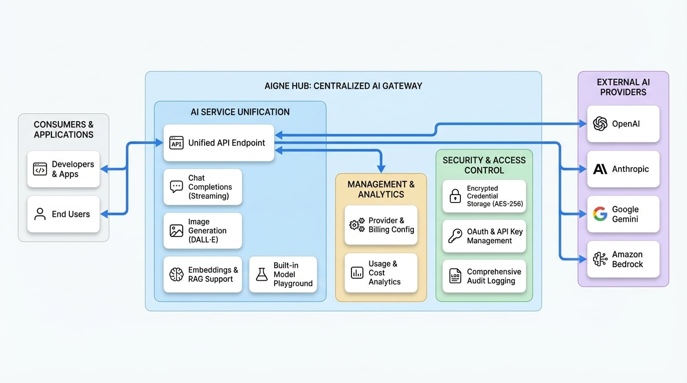

# 核心功能

本节将深入技术层面，探讨 AIGNE Hub 的关键功能。阅读完毕后，您将理解该平台的主要能力，从统一的 AI 模型交互和提供商管理，到强大的安全性和详尽的分析，为充分利用该系统奠定坚实的基础。

AIGNE Hub 被设计为一个中央网关，旨在简化与各种大型语言模型 (LLM) 和 AI 服务的所有交互。它统一了 API 访问，集中了安全性，并提供了对使用情况和成本的全面可见性。该平台的各项功能旨在同时支持企业内部部署和多租户服务提供商模式。

下图简要概述了 AIGNE Hub 的架构及其核心组件。

<!-- DIAGRAM_IMAGE_START:architecture:16:9 -->

<!-- DIAGRAM_IMAGE_END -->

有关特定功能的更多详细信息，请参阅以下部分：

<x-cards data-columns="3">
  <x-card data-title="提供商管理" data-href="/features/provider-management" data-icon="lucide:cloud">
  了解如何连接、配置和管理上游 AI 提供商。
  </x-card>
  <x-card data-title="用量与成本分析" data-href="/features/analytics" data-icon="lucide:bar-chart-2">
  了解如何监控全系统和每位用户的消耗和成本。
  </x-card>
  <x-card data-title="安全与访问" data-href="/features/security" data-icon="lucide:shield-check">
  查看安全架构，包括访问控制和数据保护。
  </x-card>
</x-cards>

## AI 服务统一化

AIGNE Hub 提供一组单一、一致的 API 端点，从而简化了与多个 AI 提供商集成的复杂性。这使得开发人员可以构建应用程序而不被特定供应商锁定，并能够无缝切换模型。

### 核心 AI 能力

该平台为最常见的生成式 AI 模式提供标准化访问：

-   **💬 聊天补全**：与对话式 AI 和高级文本生成模型进行交互，适用于广泛的应用场景。系统通过与 OpenAI 兼容的 API 支持标准和流式响应。
-   **🖼️ 图像生成**：访问如 DALL·E 等生成式图像模型，用于 AI 驱动的图像创建和编辑任务。
-   **🧠 嵌入**：生成文本的向量表示，用于语义搜索、聚类和检索增强生成 (RAG) 等用例。

### 内置模型演练场

AIGNE Hub 包含一个交互式演练场，用于实时测试和试验任何已连接的 AI 模型。该工具对于提示工程、模型比较和快速原型设计非常有价值，无需编写任何代码。

## 集中管理与分析

高效的管理和运营可见性是 AIGNE Hub 设计的核心。该平台提供一个统一的仪表盘，用于控制、监控和分析所有与 AI 相关的活动。

### 提供商与计费配置

通过单一的管理界面，您可以管理服务的所有方面。

-   **提供商管理**：连接到不断增长的 AI 提供商列表，包括 OpenAI、Anthropic、Google Gemini 和 Amazon Bedrock。凭证将被加密并安全存储。
-   **灵活的计费系统**：支持两种主要操作模式。对于内部使用，您可以连接自己的提供商密钥并直接向他们付款。对于面向公众的服务，您可以启用基于积分的计费系统，设置自定义费率，并通过您的 AI 网关实现盈利。

### 用量与成本分析

分析仪表盘可提供对所有提供商、模型和用户的消耗与支出的深入洞察。

-   **用量追踪**：实时监控关键指标，如令牌消耗、API 请求和延迟。
-   **成本分析**：追踪您在提供商账户上的支出，或者在服务提供商模式下，监控收入和积分消耗。这些数据对于预算制定、预测和优化 AI 支出至关重要。

## 安全与访问控制

AIGNE Hub 采用企业级安全设计，以保护敏感数据并确保对强大 AI 模型的受控访问。

-   **加密凭证存储**：所有上游提供商的 API 密钥和凭证均使用 AES-256 加密，以防止未经授权的访问。
-   **OAuth 集成**：通过行业标准的 OAuth 2.0 协议，为应用程序和用户提供安全访问。
-   **API 密钥管理**：在 AIGNE Hub 内生成和管理 API 密钥，实现对应用程序访问的精细控制。
-   **审计日志**：全面的审计追踪记录所有重要事件，包括 API 请求、配置更改和用户活动，确保问责制与合规性。

## 总结

AIGNE Hub 提供了一套全面的功能，旨在统一、管理和保护您组织对生成式 AI 的访问。通过集中化提供商集成、提供详细分析并强制执行强大的安全措施，它成为任何使用 AI 构建团队的关键基础设施组件。

要继续了解，请浏览每个核心功能领域的详细文档：

-   **[提供商管理](./features-provider-management.md)**：深入了解连接和配置 AI 服务的具体细节。
-   **[用量与成本分析](./features-analytics.md)**：学习如何利用分析仪表盘获取运营洞察。
-   **[安全与访问](./features-security.md)**：详细了解平台的安全机制。