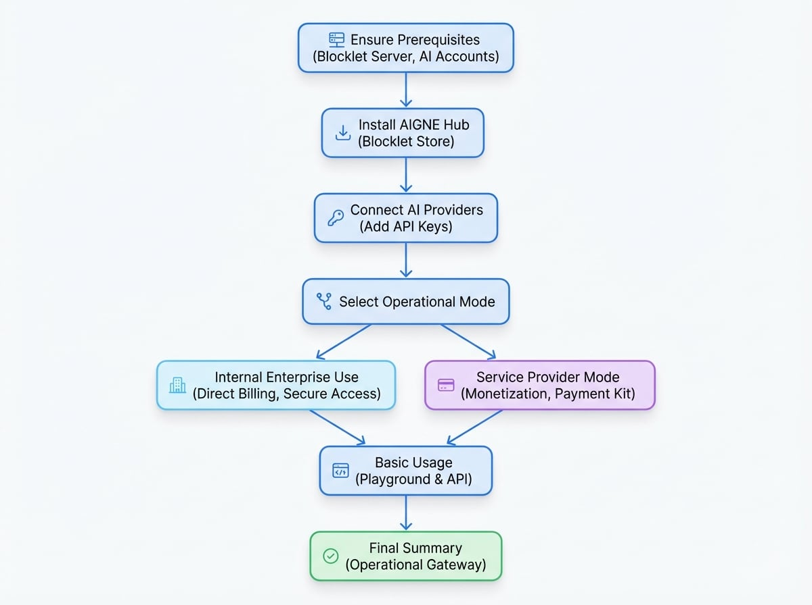
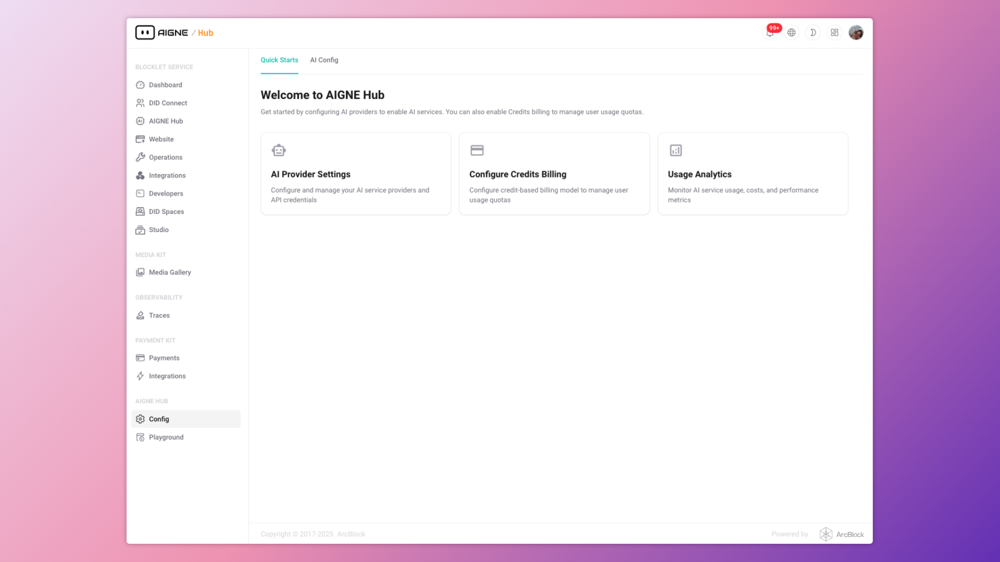
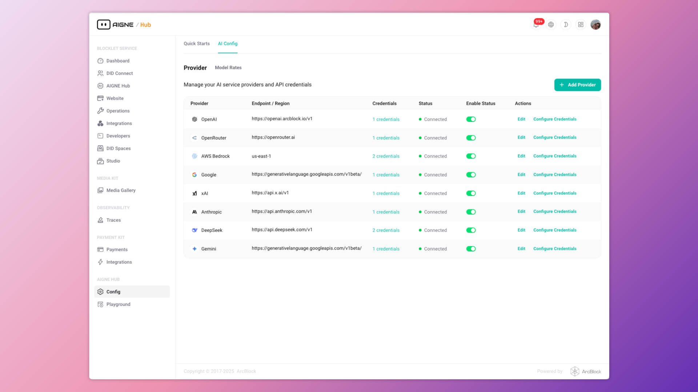
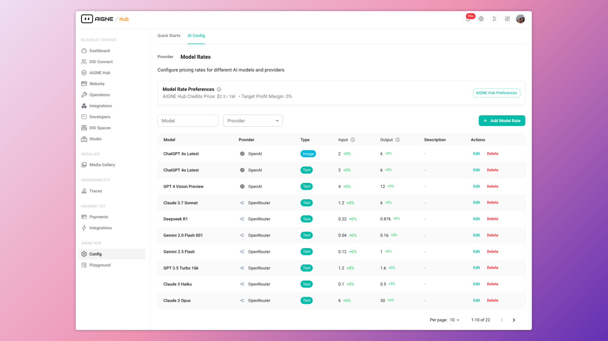
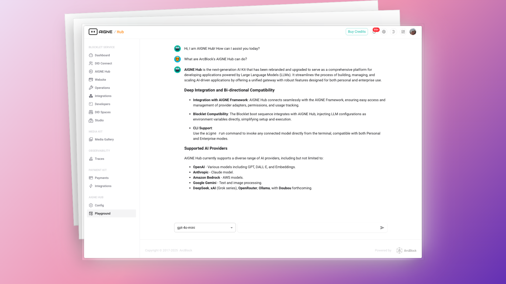

# Getting Started

This guide provides a direct, task-oriented path to deploying and operating AIGNE Hub. By following these steps, a functional instance can be configured in under 30 minutes, enabling immediate integration with upstream AI providers and downstream applications.

The following diagram illustrates the core workflow for getting started:
<!-- DIAGRAM_IMAGE_START:guide:4:3 -->

<!-- DIAGRAM_IMAGE_END -->

## Prerequisites

Before proceeding, ensure the following requirements are met:

*   **Blocklet Server:** A running instance of Blocklet Server is required to host AIGNE Hub.
*   **AI Provider Accounts:** You must have active accounts and corresponding API keys for the AI services you intend to connect (e.g., OpenAI, Anthropic, Google Gemini).

## Step 1: Install AIGNE Hub

AIGNE Hub is distributed as a Blocklet, ensuring a standardized and straightforward installation process.

1.  Navigate to the **Blocklet Store** within your Blocklet Server instance.
2.  Use the search bar to find "AIGNE Hub".
3.  Click the **"Launch"** button on the AIGNE Hub blocklet page.
4.  Follow the on-screen installation wizard to complete the deployment. The system will handle the necessary setup and configuration automatically.

After the installation is complete, AIGNE Hub will be running and accessible from your Blocklet Server dashboard.



## Step 2: Connect AI Providers

Once installed, the next step is to connect AIGNE Hub to your chosen AI providers. All credentials are AES-encrypted at rest to ensure security.

1.  Access the AIGNE Hub admin dashboard.
2.  Navigate to the configuration section via the sidebar: **Config → AI Providers**.
3.  Click the **"+ Add Provider"** button to open the configuration modal.
4.  Select the desired provider from the list (e.g., OpenAI, Google Gemini).
5.  Enter your API key and any other required credentials or parameters.
6.  Save the configuration. The provider will now appear in the list with a "Connected" status if the credentials are valid.

Repeat this process for all the AI providers you wish to manage through AIGNE Hub.



## Step 3: Choose an Operational Mode

AIGNE Hub can be configured for two primary deployment scenarios. Your choice determines the next steps for usage and integration.

### For Internal Enterprise Use

This is the default and simplest mode, designed for teams that need a centralized AI gateway for internal applications.

*   **Direct Billing:** Your organization is billed directly by the AI providers (OpenAI, Anthropic, etc.). AIGNE Hub tracks usage for analytics but does not handle payments.
*   **Secure Access:** Integrate with your existing OAuth provider for secure, single-sign-on access for internal developers and applications.

With providers configured, your AIGNE Hub instance is ready for immediate use. Proceed to the [Basic Usage](#basic-usage) section.

### For Use as a Service Provider

This mode turns AIGNE Hub into a multi-tenant, monetized service by enabling the credit-based billing system.

*   **Monetization:** Charge end-users for AI usage on a credit basis. You set the pricing per model, creating a margin over the costs from the upstream provider.
*   **Payment Kit Integration:** This mode requires installing the **Payment Kit** blocklet, which handles credit purchases, invoicing, and payment processing.
*   **User Onboarding:** Automatically grant new users a starting balance of credits to encourage adoption.

To enable this mode, navigate to **Preferences**, enable credit-based billing, and configure your model pricing rates.



## Step 4: Basic Usage

After configuration, you can begin making API requests through AIGNE Hub's unified endpoint or test models directly in the built-in Playground.

### Using the Playground

The Playground provides a no-code interface for interacting with any connected AI model. It is an excellent tool for testing, prompt engineering, and demonstrations.

1.  Navigate to the **Playground** section in the AIGNE Hub dashboard.
2.  Select a connected model from the dropdown menu.
3.  Enter your prompt and submit to receive a response.



### Programmatic Usage

Integrate AIGNE Hub into your applications by making API calls to its OpenAI-compatible endpoints. The following example shows how to use the `@aigne/aigne-hub` client library.

```typescript AIGNEHubChatModel.ts icon=logos:typescript
// Using AIGNE Framework with AIGNE Hub
import { AIGNEHubChatModel } from "@aigne/aigne-hub";

const model = new AIGNEHubChatModel({
  baseURL: "https://your-aigne-hub-url",
  apiKey: "your-oauth-access-key", // Use an access key generated via OAuth
  model: "aignehub/gpt-3.5-turbo", // Prefix model with 'aignehub/'
});

const result = await model.invoke({
  messages: "Hello, AIGNE Hub!",
});

console.log(result);
```

This code snippet initializes a chat model client pointing to your self-hosted AIGNE Hub instance. It authenticates using an OAuth access key and makes a request to the `gpt-3.5-turbo` model through the gateway.

## Summary

You have now successfully deployed, configured, and tested your AIGNE Hub instance. The gateway is operational and ready to serve AI capabilities to your teams and applications.

For more advanced configurations and a deeper dive into the platform's features, refer to the following documentation:

<x-cards data-columns="2">
  <x-card data-title="Deployment Scenarios" data-icon="lucide:server" data-href="/deployment-scenarios">
  Explore detailed architectures for enterprise self-hosting and public service provider modes.
  </x-card>
  <x-card data-title="API Reference" data-icon="lucide:code" data-href="/api-reference">
  Review the technical specifications for the Chat Completions, Image Generation, and Embeddings endpoints.
  </x-card>
</x-cards>