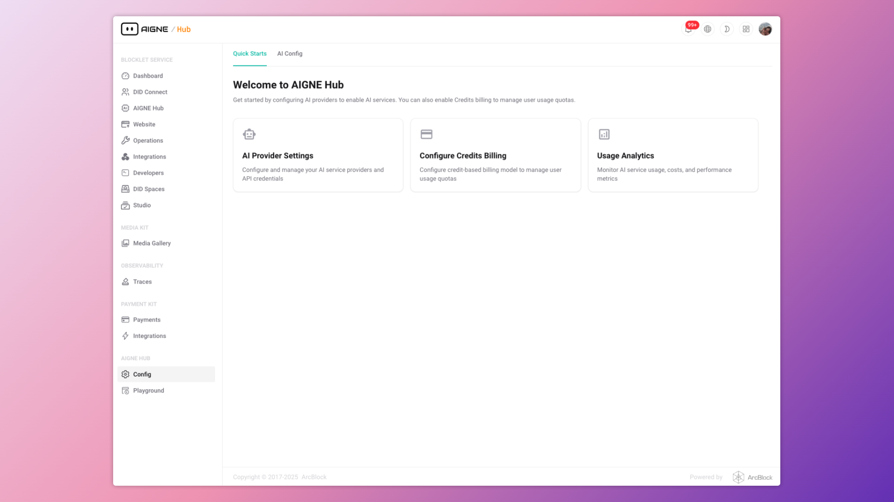

# 概要

AIGNE Hub は、多種多様な大規模言語モデル (LLM) および AI 生成コンテンツ (AIGC) プロバイダーへの接続を管理および効率化するために設計された、統合 AI ゲートウェイです。AIGNE エコシステム内の中核コンポーネントとして機能し、複数の API キーの処理、使用状況の追跡、さまざまな AI サービスにまたがる請求管理の複雑さを抽象化します。

このシステムはセルフホスト型として設計されており、組織が自身のデータと AI 運用を完全に制御できるようにします。すべての AI 関連リクエストを単一のセキュアなエンドポイント経由でルーティングすることにより、AIGNE Hub は一貫したセキュリティ、監視、およびガバナンスを保証します。

```d2
direction: down

User-Application: {
  label: "ユーザー / アプリケーション"
  shape: c4-person
}

Self-Hosted-Infrastructure: {
  label: "セルフホストインフラストラクチャ"
  style: {
    stroke-dash: 4
  }

  AIGNE-Hub: {
    label: "AIGNE Hub\n(統合 AI ゲートウェイ)"
    shape: rectangle

    Unified-API-Endpoint: {
      label: "統合 API エンドポイント\n(OpenAI 互換)"
    }

    Central-Management: {
      label: "中央管理 & 機能"
      shape: rectangle
      grid-columns: 2

      Secure-Credential-Storage: { label: "安全な認証情報\nストレージ" }
      Usage-Analytics: { label: "使用状況分析" }
      Flexible-Billing-System: { label: "柔軟な請求\nシステム" }
    }
    
    Unified-API-Endpoint -> Central-Management
  }
}

External-Services: {
  grid-columns: 2
  grid-gap: 200

  AI-Providers: {
    label: "AI プロバイダー"
    shape: rectangle
    grid-columns: 2

    OpenAI: {}
    Anthropic: {}
    Google-Gemini: { label: "Google Gemini"}
    Amazon-Bedrock: { label: "Amazon Bedrock"}
    Ollama: {}
    "Others...": {label: "その他..."}
  }

  Payment-Kit: {
    label: "Payment Kit\n(サービスプロバイダーモード用)"
    shape: rectangle
  }
}

User-Application -> Self-Hosted-Infrastructure.AIGNE-Hub.Unified-API-Endpoint: "1. AI リクエスト"
Self-Hosted-Infrastructure.AIGNE-Hub -> External-Services.AI-Providers: "2. 特定のプロバイダーへルーティング"
Self-Hosted-Infrastructure.AIGNE-Hub.Central-Management.Flexible-Billing-System <-> External-Services.Payment-Kit: "クレジットと請求を管理"
```

## 主な機能

AIGNE Hub は、社内エンタープライズ利用と、顧客に AI 機能を提供しようとするサービスプロバイダーの両方向けに設計された、包括的な機能セットを提供します。

<x-cards data-columns="3">
  <x-card data-title="統合 API アクセス" data-icon="lucide:plug-zap">
    OpenAI、Anthropic、Google Gemini を含む 8 社以上の一流 AI プロバイダーに、単一で一貫性のある OpenAI 互換の API エンドポイントを通じて接続します。
  </x-card>
  <x-card data-title="一元管理" data-icon="lucide:database">
    単一のダッシュボードで、接続されているすべてのモデルとユーザーの使用状況、コスト、パフォーマンスを完全に可視化します。
  </x-card>
  <x-card data-title="安全な認証情報ストレージ" data-icon="lucide:shield-check">
    すべてのプロバイダーの API キーと認証情報は AES 暗号化されて保管され、機密情報が保護されることを保証します。
  </x-card>
  <x-card data-title="使用状況分析" data-icon="lucide:pie-chart">
    トークン消費量を追跡し、コストを分析し、パフォーマンスメトリクスを監視して、AI 関連の支出とリソース割り当てを最適化します。
  </x-card>
  <x-card data-title="柔軟な請求システム" data-icon="lucide:credit-card">
    社内利用向けに「bring-your-own-key (自身のキーを使用する)」モデルで運用するか、オプションのクレジットベースの請求システムを有効にして AI サービスを収益化します。
  </x-card>
  <x-card data-title="セルフホストによる制御" data-icon="lucide:server">
    自身のインフラストラクチャ内に AIGNE Hub をデプロイし、データプライバシー、セキュリティ、および運用管理を最大限に高めます。
  </x-card>
</x-cards>



## サポートされている AI プロバイダー

AIGNE Hub は、幅広い AI プロバイダーへの組み込みサポートを提供しており、新しい統合も継続的に追加されています。プラットフォームは、新しいプロバイダーが利用可能になると自動的に検出し、サポートします。

| プロバイダー | サポートされているモデル/サービス |
| :--- | :--- |
| **OpenAI** | GPT モデル、DALL-E、Embeddings |
| **Anthropic** | Claude モデル |
| **Amazon Bedrock** | AWS ホストモデル |
| **Google Gemini** | Gemini Pro、Vision |
| **DeepSeek** | 高度な推論モデル |
| **Ollama** | ローカルモデルのデプロイ |
| **OpenRouter** | 複数のプロバイダーへのアクセス |
| **xAI** | Grok モデル |
| **Doubao** | Doubao AI モデル |
| **Poe** | Poe AI プラットフォーム |


## デプロイシナリオ

AIGNE Hub は、さまざまな組織のニーズに対応するため、主に 2 つの運用モデルに対応できるように設計されています。

### エンタープライズセルフホスティング

このモデルは、厳格なデータ管理とプライバシーを必要とする社内チームや組織に最適です。

- **インフラストラクチャ**: 組織のプライベートインフラストラクチャ内に完全にデプロイされます。
- **請求**: 外部への請求は不要です。組織は AI プロバイダーに直接支払います。
- **データセキュリティ**: すべてのデータと API 認証情報は、企業のセキュリティ境界内に留まります。
- **ユースケース**: 企業の AI イニシアチブ、社内開発チーム、研究プロジェクトに適しています。

### サービスプロバイダーモード

このモデルにより、組織は AIGNE Hub をマルチテナントの収益化プラットフォームに変えることで、外部の顧客に AI サービスを提供できます。

- **請求**: Payment Kit と統合し、クレジットベースの請求システムを有効にします。
- **価格設定**: オペレーターはモデルごとにカスタムの価格レートを設定でき、利益率を確保できます。
- **ユーザーオンボーディング**: 設定可能なスタータークレジットによる自動ユーザーオンボーディングをサポートします。
- **ユースケース**: SaaS プラットフォーム、AI サービスプロバイダー、およびクライアント向けの AI 搭載ソリューションを構築する代理店に最適です。

## まとめ

AIGNE Hub は、AIGNE エコシステム内におけるすべての生成 AI インタラクションの中心的なゲートウェイとして機能します。複数の AI プロバイダーを使用する際の運用上の複雑さを簡素化し、認証情報の一元管理を通じてセキュリティを強化し、監視と請求のための堅牢なツールを提供します。柔軟なデプロイモデルを提供することで、社内開発から一般向けの AI サービスまで、幅広いユースケースをサポートします。

システムの構造について詳しく理解するには、[アーキテクチャ](./architecture.md) のセクションに進んでください。