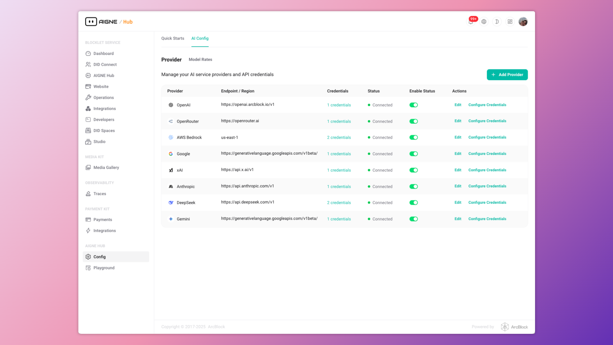

# 概述

AIGNE Hub 是一个统一的 AI 网关，旨在管理和简化与各种大型语言模型（LLM）和 AI 生成内容（AIGC）提供商的连接。它作为 AIGNE 生态系统中的核心组件，简化了处理多个 API 密钥、跟踪使用情况以及管理各种 AI 服务的计费等复杂性。

该系统设计为自托管，使组织能够完全控制其数据和 AI 操作。通过将所有与 AI 相关的请求路由到单一、安全的端点，AIGNE Hub 确保了一致的安全性、监控和治理。

```d2
direction: down

User-Application: {
  label: "用户/应用程序"
  shape: c4-person
}

Self-Hosted-Infrastructure: {
  label: "自托管基础设施"
  style: {
    stroke-dash: 4
  }

  AIGNE-Hub: {
    label: "AIGNE Hub\n(统一 AI 网关)"
    shape: rectangle

    Unified-API-Endpoint: {
      label: "统一 API 端点\n(兼容 OpenAI)"
    }

    Central-Management: {
      label: "中央管理与功能"
      shape: rectangle
      grid-columns: 2

      Secure-Credential-Storage: { label: "安全凭证\n存储" }
      Usage-Analytics: { label: "使用情况分析" }
      Flexible-Billing-System: { label: "灵活的计费\n系统" }
    }
    
    Unified-API-Endpoint -> Central-Management
  }
}

External-Services: {
  grid-columns: 2
  grid-gap: 200

  AI-Providers: {
    label: "AI 提供商"
    shape: rectangle
    grid-columns: 2

    OpenAI: {}
    Anthropic: {}
    Google-Gemini: { label: "Google Gemini"}
    Amazon-Bedrock: { label: "Amazon Bedrock"}
    Ollama: {}
    "Others...": {}
  }

  Payment-Kit: {
    label: "Payment Kit\n(适用于服务提供商模式)"
    shape: rectangle
  }
}

User-Application -> Self-Hosted-Infrastructure.AIGNE-Hub.Unified-API-Endpoint: "1. AI 请求"
Self-Hosted-Infrastructure.AIGNE-Hub -> External-Services.AI-Providers: "2. 路由到特定提供商"
Self-Hosted-Infrastructure.AIGNE-Hub.Central-Management.Flexible-Billing-System <-> External-Services.Payment-Kit: "管理额度与计费"
```

## 主要功能

AIGNE Hub 提供一套全面的功能，既适用于企业内部使用，也适用于希望向其客户提供 AI 功能的服务提供商。

<x-cards data-columns="3">
  <x-card data-title="统一 API 访问" data-icon="lucide:plug-zap">
    通过一个统一、兼容 OpenAI 的 API 端点，连接包括 OpenAI、Anthropic 和 Google Gemini 在内的超过 8 家领先的 AI 提供商。
  </x-card>
  <x-card data-title="集中化管理" data-icon="lucide:database">
    单一仪表盘提供对所有连接的模型和用户的使用情况、成本和性能的全面可见性。
  </x-card>
  <x-card data-title="安全凭证存储" data-icon="lucide:shield-check">
    所有提供商的 API 密钥和凭证均在静态时进行 AES 加密，确保敏感信息得到保护。
  </x-card>
  <x-card data-title="使用情况分析" data-icon="lucide:pie-chart">
    跟踪令牌消耗、分析成本并监控性能指标，以优化 AI 支出和资源分配。
  </x-card>
  <x-card data-title="灵活的计费系统" data-icon="lucide:credit-card">
    为内部使用提供“自带密钥”模式，或启用可选的基于额度的计费系统以实现 AI 服务的商业化。
  </x-card>
  <x-card data-title="自托管控制" data-icon="lucide:server">
    在您自己的基础设施内部署 AIGNE Hub，以实现最大限度的数据隐私、安全性和运营控制。
  </x-card>
</x-cards>


## 支持的 AI 提供商

AIGNE Hub 为众多 AI 提供商提供内置支持，并且持续添加新的集成。平台会自动发现并支持新的可用提供商。

| 提供商 | 支持的模型/服务 |
| :--- | :--- |
| **OpenAI** | GPT 模型、DALL-E、Embeddings |
| **Anthropic** | Claude 模型 |
| **Amazon Bedrock** | AWS 托管模型 |
| **Google Gemini** | Gemini Pro、Vision |
| **DeepSeek** | 高级推理模型 |
| **Ollama** | 本地模型部署 |
| **OpenRouter** | 访问多个提供商 |
| **xAI** | Grok 模型 |
| **Doubao** | 豆包 AI 模型 |
| **Poe** | Poe AI 平台 |



## 部署场景

AIGNE Hub 旨在适应两种主要的运营模式，以满足不同的组织需求。

### 企业自托管

此模式非常适合需要严格数据控制和隐私保护的内部团队和组织。

- **基础设施**：完全部署在组织的私有基础设施内。
- **计费**：无需外部计费；组织直接向 AI 提供商付款。
- **数据安全**：所有数据和 API 凭证都保留在企业安全边界内。
- **使用场景**：适用于企业 AI 项目、内部开发团队和研究项目。

### 服务提供商模式

此模式允许组织通过将 AIGNE Hub 转变为一个多租户、可商业化的平台，向外部客户提供 AI 服务。

- **计费**：与 Payment Kit 集成，以启用基于额度的计费系统。
- **定价**：运营者可以为每个模型设置自定义的定价费率，从而获得利润空间。
- **用户引导**：支持自动用户引导，并可配置初始赠送额度。
- **使用场景**：非常适合 SaaS 平台、AI 服务提供商以及为客户构建 AI 驱动解决方案的机构。

## 总结

AIGNE Hub 是 AIGNE 生态系统中所有生成式 AI 交互的中央网关。它简化了使用多个 AI 提供商的操作复杂性，通过集中式凭证管理增强了安全性，并为监控和计费提供了强大的工具。通过提供灵活的部署模式，它支持从内部开发到面向公众的 AI 服务的广泛使用场景。

要详细了解系统的结构，请继续阅读 [架构](./architecture.md) 部分。