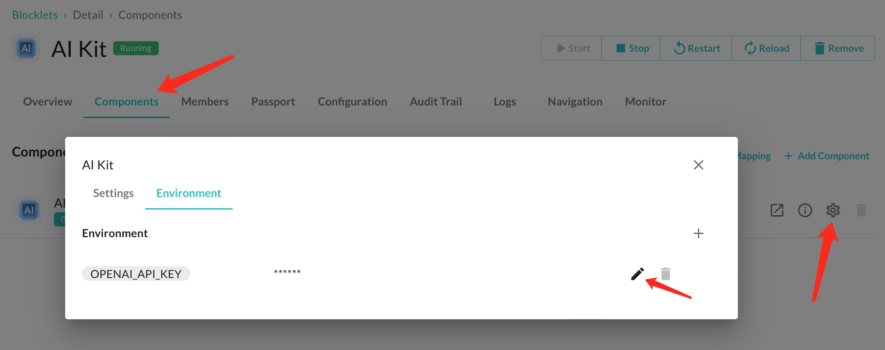

# AI Kit

AI Kit is a blocklet that brings AI capabilities to other blocklets. With AI Kit, developers can easily incorporate AI into their projects and create powerful applications.

## Features

- Easy to use interface for integrating AI into applications
- Supports popular AI providers such as OpenAI

## Install and Run

- Click the Launch button
- You need to purchase a Blocklet Server first (if you don't already have one)
- Follow the installation wizard to install blocklet on your Blocklet Server
- Start the installed blocklet in the Blocklet Server console
- Set `OPENAI_API_KEY` in **Blocklets -> AI Kit -> Components -> AI Kit -> Settings -> Environment** and restart blocklet
  
- Access the public address of the blocklet, you can open playground apps menu

## Integrate into your blocklet

- Add AI Kit as a component into your blocklet
- Set `OPENAI_API_KEY` in `AI Kit` component settings and restart your blocklet
- Call AI Kit's api

## AI Kit api references

### status

Get AI Kit status, it would return `available: true` if it is available.

```ts
const res = await Component.call({
  name: 'ai-kit',
  path: '/api/v1/sdk/status',
  data: {}
})

res // { available: boolean }
```

### completions

Autocomplete given text by AI.

```ts
const res = await Component.call({
  name: 'ai-kit',
  path: '/api/v1/sdk/completions',
  data: {
	prompt: 'Say hi'
  }
})

res // { choices: { text: string }[] }
```

## How to get api key of OpenAI

1. Create an OpenAI Account at <https://openai.com/api>

2. Request an API Key

   Once you have logged in to your OpenAI account, you will need to request an API key. To do this, click on the “My Account” tab at the top of the page. On the “My Account” page, you will see a link to “Request an API Key”. Click this link and you will be taken to a page where you can request an API key.

## Support

If you have any questions or need help getting started, please feel free to reach out to us at <liyechao@arcblock.io>. We are happy to help!
